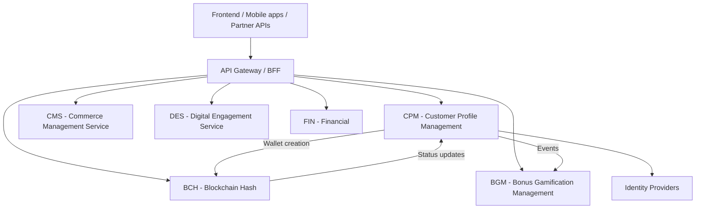
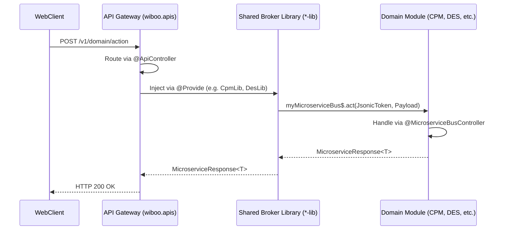

# WiBOO Platform Architecture Overview

## System Context & Platform Architecture

The WiBOO Platform is a comprehensive multi-tenant fintech and e-commerce system serving the Brazilian market. It relies on a microservices-based architecture, highly decoupled, connected via an API Gateway/BFF layer.

### Core Architecture Diagram

### Platform Services

- **CPM** (Customer Profile Management): The core identity backbone. Handles authentication, user directories, multi-tenancy configurations, whitelabels, and wallets.
- **CMS** (Checkout Commerce Management Service): Manages shopping carts, product catalog, and checkout processing.
- **BGM** (Bonus Gamification Management): Rewards system, tracking gamified mechanics.
- **BCH** (Blockchain Handler): The core for all blockchain operations. Handles Hyperledger and Ethereum blockchain deployments, syncing, and interaction holding the WiBX Token contracts.
- **DES** (Digital Engagement Service): Microservice for Engagement Tracking of games, customers, and enterprises. Controls history, engagement balances, multi-strategy referrals tracking (MGM, subscriptions), and coordinates with FIN for billing.
- **FIN** (Finance Management Service): Responsible for customer finance management. It stores financial transactions, locks logic to manage customer account balances safely, aggregates internal crypto transactions before pushing to BCH, and collects blockchain fees via configurable Tax Splitters.
- **TAM** (Token Authentication Management): Handles all interfaces with JWT providers and validates tokens according to specialized structural flows.
- **EMS** (Enterprise Management Service): Provides core registry features for Enterprises (address, contact info, logos), program management, and supports geolocation and fuzzy string matching.
- **SCS** (Scheduler Service): Manages and triggers scheduled chron jobs across the platform.

## Core Platform Modules

The platform consists of specialized domains handling specific business requirements:

1. **Identity & Multi-Tenancy (CPM)**: Authentication, SSO, User directories, and Whitelabel isolation boundaries.
2. **Digital Engagement (DES)**: SmartForms creation, surveys, Multi-strategy Referral systems.
3. **Financial & Logic (FIN / BGM)**: Account balances, strict transaction locking, Tax Splitting (FIN), rewards calculation (BGM).
4. **Blockchain (BCH / TAM)**: Core protocol interaction (BCH) and Token JWT validations (TAM).

### Generic Component Architecture

Every business domain in WiBOO is divided conceptually into three major layers over the network:

### Integration & Communication

Services communicate over a decentralized **Command Queue Framework** utilizing Valkey (Redis-compatible). The end-to-end request lifecycle follows a strict topology across ALL domains:

1. **API Layer (`wiboo.apis`)**:
   - Exposes REST endpoints via `@ApiController`.
   - Handles HTTP protocol specifics (cookies, session unpacking, validations).
   - Wraps calls to external modules via Dependency Injecting shared Client Libraries (e.g., `cpm-lib`, `des-lib`).
2. **Broker Client (`libs/clients/*-lib`)**:
   - Agnostic library decorated with `@MicroserviceBusController` defining `clientConnectors` payloads.
   - Uses `myMicroserviceBus$.act<T, U>` to serialize the request, append trace contexts (`TraceContext`), and map it to a `JsonicToken` routing key.
3. **Module Service (Backend Microservices - e.g., CPM, DES, FIN)**:
   - Contains a handler class annotated with `@MicroserviceBusController` mapped to the receiving end of the queue.
   - Subscribes to specific paths via the `@Add(JsonicToken)` mapping.
   - Unwraps the standardized `MicroserviceRequest` to execute business orchestration and returns a `MicroserviceResponse` payload back to the bus.

- **Request/Response (`act() / send()`)**: Synchronous flow block waiting for replies.
- **Fire-and-Forget (`actAsync() / emit()`)**: Asynchronous queuing for event triggering and notifications without blocking the primary request path.

### Data Architecture Strategy

To enforce the multi-tenancy principle and achieve high performance:
- Data scoped to tenants is **hard-partitioned** by `WLC` (Whitelabel Code). E.g. `whitelabels_users` is portioned via declarative partitioning. All DAOs strictly enforce `wlc` indexing.
- Master entities (`users`, `users_identifiers`) use a composite key (`user_directory_id`, `user_id`) to map one global user identity across multiple internal directories/IDPs.
- The platform uses a massive **Two-Level Cache** protocol (L1: Valkey in-memory, L2: PostgreSQL materialised representations) optimized for ~3-5ms response times.
