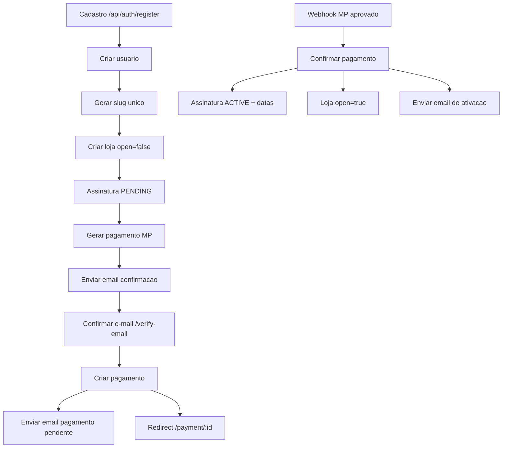

# Chama no espeto

Aplicação web para pedidos e gestão do restaurante de espetinhos Datony. O projeto traz duas experiências principais:

- **Loja do cliente**: montagem e edição do pedido, envio para WhatsApp e pagamento via chave Pix.
- **Painel interno**: dashboard com métricas, CRUD de produtos, fila do churrasqueiro (atualização a cada 5s) e histórico de pedidos.

## Estrutura de pastas

- `frontend/`: aplicação React (Create React App) servida pelo nginx em produção.
- `backend/`: API Node.js/Express + TypeORM em TypeScript, com documentação Swagger em `/api/docs`.
- `docker-compose.yml`: sobe frontend, API, PostgreSQL e pgAdmin já apontando para as pastas certas.

## Visão geral do stack

- **Front-end**: React (Create React App) servido por nginx (`frontend/Dockerfile`).
- **API**: Node.js/Express/TypeORM (`backend/`).
- **Banco de dados**: PostgreSQL com schema em `backend/schema.sql` e recursos opcionais de administração via pgAdmin.

Requisitos mínimos para desenvolvimento local:

- Node.js 18+ e npm/yarn
- PostgreSQL 16+ (local) ou Docker
- Docker + Docker Compose (opcional, recomendado)

## Rodar local com Docker Compose (recomendado)

```bash
cp backend/.env.docker.example backend/.env.docker
docker compose up --build
```

Serviços locais:
- Front-end: `http://localhost:8080`
- API: `http://localhost:4000` (Swagger em `/api/docs`)

## Rodar local sem Docker

1) **Instalar dependências**

```bash
cd backend && npm install
cd ../frontend && npm install
```

2) **Banco local**

```bash
createdb espetinho
psql -h localhost -U postgres -d espetinho -f backend/schema.sql
```

3) **Configurar envs**

```bash
cp backend/.env.example backend/.env
```

Edite `backend/.env` e ajuste `PG*`, `PORT` e `JWT_SECRET`.

Crie `frontend/.env`:

```bash
VITE_API_BASE_URL=http://localhost:4000/api
```

4) **Subir**

```bash
cd backend && npm run dev
cd ../frontend && npm run dev
```

Serviços locais:
- Front-end: `http://localhost:3000`
- API: `http://localhost:4000`

## Criar primeira loja (seed de planos)

```bash
curl http://localhost:4000/api/plans
```

## Fluxo de criacao de conta (resumo)

1) Front envia `POST /api/auth/register` com dados do usuario (CPF/CNPJ), endereco com CEP e aceite de termos/LGPD.
2) API cria usuario (email nao verificado), gera slug unico, cria loja `open=false`.
3) Envia e-mail de confirmacao e redireciona para `/verify-email`.
4) Ao confirmar, o pagamento e criado e fica disponivel em `/payment/:id`.
5) E-mail de pagamento pendente e enviado com o link/QR.
5) Quando o MP aprova, o webhook confirma o pagamento, ativa a assinatura e abre a loja.
6) E-mail de ativacao e enviado com links do admin e da vitrine.

Cadastro (UX):
- Termos/LGPD aparecem em modal no `/create` e bloqueiam o envio se nao forem aceitos.
- CEP consulta ViaCEP para preencher endereco.

Assinaturas:
- Job diario marca expiracao e envia avisos em D-3, D-1 e D-0.
- Renovacao ocorre pelo painel `/admin/renewal` com escolha de plano.



## Deploy no EC2 (resumo rapido)

1) Configurar `.env.prod` com a porta do front:

```bash
FRONTEND_PORT=8080
```

2) Preparar segredos (recomendado):

```bash
cp .env.prod.secrets.example .env.prod.secrets
# edite os valores reais
```

3) Subir usando o script (preserva envs):

```bash
sh scripts/compose-prod.sh
```

4) Verificacao rapida:

```bash
docker ps
docker exec -it chamanoespeto-api env | grep -E '^(MP_|SMTP_|EMAIL_FROM|APP_BASE_URL)'
curl -s https://www.chamanoespeto.com.br/api/docs.json | head -n 1
```

5) Teste de e-mail (reset de senha):

```bash
curl -X POST https://www.chamanoespeto.com.br/api/auth/forgot-password \
  -H "Content-Type: application/json" \
  -d '{"email":"seu-email@gmail.com"}'
```

6) Webhook MP (checagem rapida):

```bash
docker logs chamanoespeto-api --tail 200 | grep -i "mercadopago\\|webhook"
```

## Teste de fluxo (manual assistido)

O script `scripts/test-flow.sh` cria usuario, confirma e-mail e valida login admin.
Requer `jq` instalado e o token de confirmacao copiado do e-mail.

```bash
sh scripts/test-flow.sh
```

3) Nginx como reverse proxy:

- Use `docs/nginx/chamanoespeto.conf`
- `/` -> `http://127.0.0.1:8080`
- `/api/` -> `http://127.0.0.1:4000/api/`
- `/uploads/` -> `http://127.0.0.1:4000/uploads/`
- `client_max_body_size 20m`

4) HTTPS:

```bash
sudo certbot --nginx -d chamanoespeto.com.br -d www.chamanoespeto.com.br
```

5) Mercado Pago (producao):

- Configure em `backend/.env.docker`:
  - `MP_ACCESS_TOKEN`
  - `MP_PUBLIC_KEY`
  - `MP_WEBHOOK_SECRET`
  - `MP_WEBHOOK_URL=https://www.chamanoespeto.com.br/api/webhooks/mercadopago`
- O webhook exige HTTPS valido.

6) SMTP (exemplo Zoho):

```
SMTP_HOST=smtp.zoho.com
SMTP_PORT=587
SMTP_USER=contato@chamanoespeto.com.br
SMTP_PASS=<senha-ou-app-password>
SMTP_SECURE=false
EMAIL_FROM=Chama no Espeto <contato@chamanoespeto.com.br>
```

Se configurar assinatura secreta no painel, defina `MP_WEBHOOK_SECRET` na API.

### O que é ngrok (explicação rápida)
ngrok cria um túnel público temporário para seu servidor local. Isso permite que o Mercado Pago envie o webhook para sua máquina local durante testes. Sempre que você reiniciar o ngrok, a URL pública muda (a menos que use um plano pago com URL fixa).

## Execução local (sem Docker)

### Fluxo rápido (local)

```bash
cp backend/.env.example backend/.env
docker start chamanoespeto-postgres
cd backend && npm run dev
```

Para o front:

```bash
cd frontend && npm run dev
```

### 1. Banco de dados

1. Crie um banco chamado `espetinho` e aplique o schema inicial (opcional, a API também cria tabelas on-demand):

    ```bash
    psql -h localhost -U postgres -d espetinho -f backend/schema.sql
    ```

2. Variáveis de conexão usadas pelo `pg` (padrões: `postgres` / `postgres`):

    ```bash
    export PGHOST=localhost
    export PGUSER=postgres
    export PGPASSWORD=postgres
    export PGDATABASE=espetinho
    ```

### 2. API (pasta `backend/`)

```bash
cd backend
npm install
npm run dev    # desenvolvimento com reload
npm run build  # gera dist/
npm start      # roda dist/app.js
```

A API sobe em `http://localhost:4000` e expõe a documentação Swagger em `http://localhost:4000/api/docs`. Durante a inicialização ela valida a conexão com o PostgreSQL usando as variáveis de ambiente listadas acima.

Endpoints principais:

- `POST /api/auth/register` — cria usuário, loja e retorna token JWT.
- `POST /api/auth/admin-login` — autenticação via slug + senha.
- `POST /api/auth/login` — autenticação via e-mail + senha.
- `GET /api/stores/:slug`, `PUT /api/stores/:id`, `PUT /api/stores/:id/status` — gerenciamento de loja.
- `GET /api/stores/:storeId/products`, `POST /api/stores/:storeId/products` — catálogo (admin).
- `GET /api/stores/slug/:slug/products` — catálogo público por loja (vitrine).
- `GET /api/stores/:storeId/orders`, `POST /api/stores/:storeId/orders` — pedidos e fila.

### 3. Front-end React (pasta `frontend/`)

```bash
cd frontend
npm install
npm run dev
```

Crie um arquivo `.env` (ou use `.env.production`) na pasta `frontend/` com o endpoint da API:

```bash
VITE_API_BASE_URL=http://localhost:4000/api
```

Com a API em execução, a loja fica acessível em:

- Vitrine (cliente): `http://localhost:3000/<slug>` (ex: `http://localhost:3000/lojadoedmilson`)
- Admin pedidos: `http://localhost:3000/admin/orders`
- Fila do churrasqueiro: `http://localhost:3000/admin/queue`

### 4. pgAdmin (opcional, local)

- Host: `localhost`
- Porta: `5432`
- Usuário: `postgres`
- Senha: a que você definiu

## Execução com Docker

### Subir tudo com Docker Compose

Antes de subir, copie o arquivo de ambiente do Docker:

```bash
cp backend/.env.docker.example backend/.env.docker
```

```bash
docker compose up --build
```

Serviços expostos:

- Front-end: http://localhost:8080
- API: http://localhost:4000 (Swagger em `/api/docs`)
- PostgreSQL: porta 5432 (volume `postgres-data`)
- pgAdmin: http://localhost:5050

### Rodar com portas de produção (porta 80)

Crie um arquivo `.env.prod` com `FRONTEND_PORT=80` e suba assim:

```bash
docker compose --env-file .env.prod up --build -d
```

### Atalhos (scripts)

Execução local (porta 8080):

```bash
sh scripts/compose-dev.sh
```

Execução produção (porta 80):

```bash
sh scripts/compose-prod.sh
```

Credenciais padrão do pgAdmin (pode sobrescrever via variáveis de ambiente ao subir): `admindatony@datony.com` / `Datony20025#!`.

### Atualizar schema (horário de funcionamento)

Para bancos existentes, a API aplica a migração automaticamente ao iniciar
(`opening_hours` e `social_links` em `store_settings`). Basta reiniciar a API.

Se quiser aplicar manualmente, use:

```sql
ALTER TABLE store_settings
ADD COLUMN IF NOT EXISTS opening_hours JSONB DEFAULT '[]';
```

Com Docker:

```bash
docker exec -i chamanoespeto-postgres psql -U postgres -d espetinho <<'SQL'
ALTER TABLE store_settings
ADD COLUMN IF NOT EXISTS opening_hours JSONB DEFAULT '[]';
SQL
```

Para um banco vazio, continue usando o `backend/schema.sql` (já contém a coluna nova).

### Imagens individuais

- **Front-end** (usa `frontend/Dockerfile` com nginx):

    ```bash
    cd frontend
    docker build -t espetinho-app .
    docker run --rm -p 80:80 espetinho-app
    ```

- **API** (usa `backend/Dockerfile`):

    ```bash
    cd backend
    docker build -t espetinho-api .
    docker run --rm -p 4000:4000 \
      -e PGHOST=<host> -e PGUSER=<usuario> -e PGPASSWORD=<senha> -e PGDATABASE=<db> \
      espetinho-api
    ```

- **PostgreSQL + schema**

    ```bash
    docker run --name espetinho-db -e POSTGRES_PASSWORD=postgres -e POSTGRES_DB=espetinho -p 5432:5432 -d postgres:16
    docker exec -i espetinho-db psql -U postgres -d espetinho < backend/schema.sql
    ```

- **pgAdmin**

    ```bash
    docker build -f Dockerfile.pgadmin -t espetinho-pgadmin .
    docker run --rm -p 5050:80 \
      -e PGADMIN_DEFAULT_EMAIL=admindatony@datony.com \
      -e PGADMIN_DEFAULT_PASSWORD=Datony20025#! \
      -v pgadmin-data:/var/lib/pgadmin \
      espetinho-pgadmin
    ```

## BPMN do fluxo da aplicação

Um diagrama BPMN resumindo o fluxo do "Chama no espeto" está disponível em `docs/bpmn/chama-no-espeto.bpmn`. O arquivo segue o padrão BPMN 2.0 (pode ser aberto no Camunda Modeler, Draw.io ou semelhantes) e destaca:

- Jornada do cliente na loja pública (montagem e envio do pedido com Pix).
- Validação e criação do pedido pela API.
- Operação diária do painel interno (cadastro, catálogo, publicação da loja e fila do churrasqueiro).

## Notas adicionais

- Ao publicar em produção (ex.: EC2), exponha apenas as portas necessárias e substitua credenciais padrão.
- O diretório `.vscode/` traz recomendações de formatação (2 espaços, LF, remoção de espaços em branco e nova linha final), aplicadas automaticamente se o Prettier estiver instalado.
Vitrine e painel com Docker:

- Vitrine (cliente): `http://localhost:8080/<slug>` (ex: `http://localhost:8080/lojadoedmilson`)
- Admin pedidos: `http://localhost:8080/admin/orders`
- Fila do churrasqueiro: `http://localhost:8080/admin/queue`
