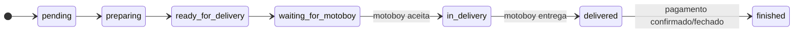
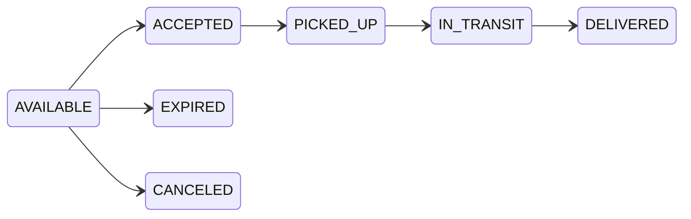

# Chama no espeto

Aplicação web para pedidos e gestão de lojas/restaurantes (cardápio, checkout, fila e pagamentos), com módulo de entrega via motoboy.

O projeto traz quatro experiências principais:

- **Loja do cliente**: montagem e edição do pedido, info da loja no mobile (sheet), WhatsApp e link de acompanhamento (publico com persistencia via `localStorage`).
- **Painel interno (Admin/Churrasqueiro)**: dashboard com métricas, CRUD de produtos, fila do churrasqueiro (atualização a cada 5s), pagamentos e histórico.
- **Acompanhar pedido**: pagina publica em `/pedido/:orderId` com status, fila, detalhes e branding da loja.
  - Ultimos 3 pedidos publicos ficam em `localStorage` para reabrir o acompanhamento (inclusive mesa).
  - Numero exibido usa prefixo do slug (3 letras) + 8 primeiros chars do ID.
- **Promoções**: produto pode ter preço promocional ativo; vitrine, carrinho, fila e acompanhamento exibem valor original riscado + promocional.
- **Entregador (Motoboy)**: fila de entregas, entrega atual, histórico, ganhos e confirmação de pagamento no final da entrega.

## Guia do usuario

- docs/user-guide.md

## Estrutura de pastas

- `frontend/`: aplicação React + Vite (servida pelo nginx em produção).
- `backend/`: API Node.js/Express + TypeORM em TypeScript, com documentação Swagger em `/api/docs`.
- `server/`: microserviço de mapas (geocode/route) usado para ETA/distância.
- `face-worker/`: worker Python (FastAPI + DeepFace) para verificação assistida de selfie vs CNH.
- `docker-compose.yml`: sobe frontend, API, PostgreSQL e pgAdmin já apontando para as pastas certas.
- `docker-compose.prod.yml`: override de produção (principalmente segurança do volume do Postgres).
- `scripts/`: utilitários de deploy/backup (`compose-prod.sh`, `pg-backup-rotate.sh`).

## Padrao de documentacao (backend)

- Todo arquivo `backend/src/**/*.ts` deve conter o cabecalho CONFIDENTIAL com `@file`, `@Date` e `@author`.
- Classes e metodos no backend devem ter TSDoc em ingles com nome e data.
- Deixar uma linha em branco entre metodos.
- A data deve refletir a criacao do arquivo (git diff-filter=A).

## Visão geral do stack

- **Front-end**: React + Vite servido por nginx (`frontend/Dockerfile`).
- **API**: Node.js/Express/TypeORM (`backend/`).
- **Banco de dados**: PostgreSQL (schema base em `backend/schema.sql` + evolução via `backend/src/utils/runMigrations.ts`).
- **Maps**: microserviço `maps` (`server/`) para Google Routes/Geocoding.
- **Face verify**: worker `face-worker` para verificação assistida de documentos do motoboy (selfie vs CNH).

Requisitos mínimos para desenvolvimento local:

- Node.js 18+ e npm/yarn
- PostgreSQL 16+ (local) ou Docker
- Docker + Docker Compose (opcional, recomendado)

## Arquitetura (alto nível)

```mermaid
flowchart LR
  U[Cliente / Admin / Motoboy] -->|HTTPS| N[Nginx (EC2)]
  N -->|/| F[Frontend (nginx)]
  N -->|/api| A[API Node (Express)]
  N -->|/uploads| A
  A --> P[(Postgres)]
  A --> M[Maps service]
  A --> W[Face worker (Python)]
```

## Rodar local com Docker Compose (recomendado)

```bash
cp backend/.env.docker.example backend/.env.docker
docker compose up --build
```

Serviços locais:
- Front-end: `http://localhost:8080`
- API: `http://localhost:4000` (Swagger em `/api/docs`)

## Produção: integridade do banco + backups

- O volume do Postgres é **pinned** por nome em `docker-compose.yml`:
  - `POSTGRES_VOLUME_NAME` (default: `edespetohub_postgres-data`)
- Em produção, `docker-compose.prod.yml` marca o volume como **external**, evitando perda acidental com `docker compose down -v`.
- A API tem bootstrap que recria o banco caso ele tenha sido dropado (e aplica `schema.sql` + migrations) para o serviço não ficar indisponível.

Backup/rotação (SQL gz) via script:

- `scripts/pg-backup-rotate.sh`
  - `MIN_INTERVAL_HOURS` (default `48`)
  - `KEEP_LATEST` (default `1`)

Exemplo (cron a cada 2 dias, mantendo apenas 1 arquivo):

```bash
BACKUP_DIR=/home/ec2-user/backups/chamanoespeto MIN_INTERVAL_HOURS=48 KEEP_LATEST=1 bash /home/ec2-user/EdEspetoHub/scripts/pg-backup-rotate.sh
```

## Rodar local sem Docker

1) **Instalar dependências**

```bash
cd backend && npm install
cd ../frontend && npm install
```

2) **Banco local**

```bash
createdb espetinho
psql -h localhost -U postgres -d espetinho -f backend/schema.sql
```

3) **Configurar envs**

```bash
cp backend/.env.example backend/.env
```

Edite `backend/.env` e ajuste `PG*`, `PORT` e `JWT_SECRET`.
Opcional: `LOG_LEVEL=debug|info|warn|error`, `LOG_TO_FILE=true` e `LOG_DIR=logs` para controlar logs e salvar em arquivo.

Opcional (producao): usar AWS SSM Parameter Store (SecureString) com um JSON unico. Configure:
- `SSM_PARAMETER_NAME` (ex: `/chamanoespeto/prod`)
- `AWS_REGION` (ex: `us-east-1`)
- `SSM_OVERRIDE=true` para sobrescrever variaveis locais
Opcional (dev local): se o SSM vier com `PGHOST=postgres`, defina `SSM_LOCAL_DB_HOST=localhost` para sobrescrever apenas no host (fora do Docker).
Opcional (debug): `SSM_LOG_KEYS=true` para logar quais chaves foram aplicadas (somente nomes).
Opcional (debug): `SSM_LOG_OVERRIDES=false` para ocultar overrides locais (padrao loga).

Exemplo de JSON no SSM:
```

Verificacao rapida:
- `aws ssm get-parameter --name /chamanoespeto/prod --with-decryption --region us-east-2`
- Ao subir a API, procure o log `SSM env loaded` (mostra o nome do parametro e a quantidade de chaves).
{
  "JWT_SECRET": "secret",
  "APP_BASE_URL": "https://chamanoespeto.com.br",
  "PGHOST": "db.prod",
  "PGPORT": "5432",
  "PGUSER": "postgres",
  "PGPASSWORD": "senha",
  "PGDATABASE": "espetinho",
  "MP_ACCESS_TOKEN": "xxx",
  "MP_PUBLIC_KEY": "xxx",
  "MP_WEBHOOK_SECRET": "xxx",
  "SMTP_HOST": "smtp.seu-dominio.com",
  "SMTP_PORT": "587",
  "SMTP_USER": "usuario",
  "SMTP_PASS": "senha",
  "SMTP_SECURE": "false",
  "EMAIL_FROM": "Chama no Espeto <contato@chamanoespeto.com.br>"
}
```

Crie `frontend/.env`:

```bash
VITE_API_BASE_URL=http://localhost:4000/api
```

4) **Subir**

```bash
cd backend && npm run dev
cd ../frontend && npm run dev
```

Serviços locais:
- Front-end: `http://localhost:3000`
- API: `http://localhost:4000`

## Google Maps Platform (migracao do mapa)

### APIs necessarias (Google Cloud)
- Maps JavaScript API
- Geocoding API
- Routes API

### Chaves e restricoes
- **Front (apenas mapa)**: use `VITE_GOOGLE_MAPS_JS_KEY` com restricao por dominio.
  - Habilitar somente **Maps JavaScript API** nessa chave.
- **Backend (geocode/rota)**: use `GOOGLE_MAPS_API_KEY` com restricao por IP/servidor.
  - Habilitar **Geocoding API** e **Routes API**.

### Estrutura
- `server/`: microservico de mapas (Express + TypeScript).
- `frontend/`: renderiza o mapa com `@googlemaps/js-api-loader`.
- Endpoints locais:
  - `POST /api/maps/geocode` → `{ lat, lng, formattedAddress }`
  - `POST /api/maps/route` → `{ distanceKm, durationMin }`

### Variaveis de ambiente

Front (`frontend/.env`):
```
VITE_GOOGLE_MAPS_JS_KEY=xxx
VITE_STORE_ORIGIN_LAT=-23.55052
VITE_STORE_ORIGIN_LNG=-46.633308
VITE_STORE_ORIGIN_LABEL=Loja
```

Backend maps server (`server/.env`):
```
PORT=5050
CORS_ORIGIN=http://localhost:3000
GOOGLE_MAPS_API_KEY=xxx
```

Produção (Docker):
```
server/.env.docker:
PORT=5050
CORS_ORIGIN=https://www.chamanoespeto.com.br
SSM_PARAMETER_NAME=/chamanoespeto/prod
AWS_REGION=us-east-2
SSM_OVERRIDE=true
GOOGLE_MAPS_API_KEY=
```
O `GOOGLE_MAPS_API_KEY` vem do SSM (JSON).

### Rodar local (Vite + Maps server)

```bash
npm install
cd server && npm install
cd ../frontend && npm install
cd ..
npm run dev
```

Rotas:
- Front: `http://localhost:3000`
- Maps server: `http://localhost:5050`
- Tela de teste: `http://localhost:3000/maps`

### Producao
- `docker-compose` sobe o serviço `maps`.
- Nginx faz proxy `/api/maps` → `maps:5050`.
- Para subir tudo: `docker compose --env-file .env.prod up --build -d`.

## Modulo de entrega + motoboy (novo)

### O que entrou (sem quebrar o que ja existe)
- Fluxo de delivery com motoboy (atribuir, aceitar, entregar e confirmar pagamento).
- Status de pedido (apenas `type='delivery'`, no `orders.status`):
  - `pending` → `preparing` → `ready_for_delivery` → `waiting_for_motoboy` → `in_delivery` → `delivered` → `finished`
- Campos de pagamento em `orders`:
  - `payment_method` (pix/credito/debito/dinheiro)
  - `payment_status` (`PENDING` | `PAID`)
  - `cash_tendered` (dinheiro: quanto o cliente informou que vai pagar)
- Novas tabelas:
  - `motoboys`
  - `motoboy_stores`
  - `order_deliveries`
  - `delivery_events` (auditoria de transições)

### Regras principais
- Motoboy so ve pedidos das lojas associadas (N:N).
- Motoboy so atua se `motoboys.status = ACTIVE`.
- Pagamento em dinheiro/cartao fica `PENDING` ate o motoboy confirmar.
- Aceite de pedido e feito com transacao (conflito 409 se ja aceito).
- Exclusividade: 1 entrega ativa por motoboy (garantido por índice parcial no Postgres).
- Concorrência: dois motoboys não aceitam o mesmo pedido (apenas 1 vence; outro recebe 409).
- Expiração: entradas de fila expiram por `expires_at`, mas se o pedido continuar `waiting_for_motoboy`, a fila reabre automaticamente como `AVAILABLE`.

### Fluxo (status do pedido vs status da entrega)


```mermaid
stateDiagram-v2
  direction LR
  [*] --> pending
  pending --> preparing
  preparing --> ready_for_delivery
  ready_for_delivery --> waiting_for_motoboy
  waiting_for_motoboy --> in_delivery : motoboy aceita
  in_delivery --> delivered : motoboy entrega
  delivered --> finished : pagamento confirmado/fechado
```

`order_deliveries.status` (workflow da entrega):


```mermaid
stateDiagram-v2
  direction LR
  AVAILABLE --> ACCEPTED
  ACCEPTED --> PICKED_UP
  PICKED_UP --> IN_TRANSIT
  IN_TRANSIT --> DELIVERED
  AVAILABLE --> EXPIRED
  AVAILABLE --> CANCELED
```

### Endpoints (novos)
Motoboy:
- `GET /motoboy/orders/available`
- `GET /motoboy/orders/current`
- `GET /motoboy/orders/history`
- `GET /motoboy/earnings/today`
- `GET /motoboy/stats?range=day|week|month`
- `POST /motoboy/orders/:orderId/accept`
- `POST /motoboy/orders/:orderId/pickup`
- `POST /motoboy/orders/:orderId/start`
- `POST /motoboy/orders/:orderId/confirm-payment`
- `POST /motoboy/orders/:orderId/delivered`
- `POST /motoboy/orders/:orderId/finish`
- `GET /motoboy/profile`
- `PUT /motoboy/profile`
- `GET /motoboy/documents`
- `POST /motoboy/documents`

Conteudo legal (publico):
- `GET /legal/terms`
- `GET /legal/lgpd`

Admin (SUPER_ADMIN):
- `POST /admin/site-settings` (key/value)

Chaves uteis em `site_settings`:
- `legal.terms`
- `legal.lgpd`
- `email_templates.store_verification.subject|text|html`
- `email_templates.motoboy_verification.subject|text|html`
- `email_templates.password_reset.subject|text|html`
- `email_templates.activation.subject|text|html`
- `email_templates.subscription_reminder.subject|text|html`

Responsavel (dono da loja):
- `POST /stores/:storeId/motoboys`
- `POST /stores/:storeId/motoboys/:motoboyId/link`
- `POST /stores/:storeId/motoboys/:motoboyId/unlink`
- `POST /stores/:storeId/motoboys/:motoboyId/approve`
- `POST /stores/:storeId/motoboys/:motoboyId/suspend`

### Compatibilidade
- Nenhum endpoint antigo foi removido.
- Campos novos sao opcionais.
- `orders.payment_status` tem default `PENDING`.

## Verificação assistida de documentos (CNH + Selfie)

Quando o motoboy envia CNH e Selfie, o sistema pode rodar uma verificação automática **assistida** (não é prova de identidade):

- Selfie deve ter **exatamente 1 rosto**
- Tenta detectar rosto na CNH e comparar
- Salva resultado em `motoboy_documents.metadata.face`
- Admin vê badge `Alta/Média/Baixa/Indisponível` e revisa manualmente
- Política de tentativas: até 3 em 24h (depois bloqueia reenvio com 429)

Detalhes completos em: `docs/FACE_VERIFY.md`

## Criar primeira loja (seed de planos)

```bash
curl http://localhost:4000/api/plans
```

## Fluxo de criacao de conta (resumo)

1) Front envia `POST /api/auth/register` com dados do usuario (CPF/CNPJ), endereco com CEP e aceite de termos/LGPD.
2) API cria usuario (email nao verificado), gera slug unico, cria loja `open=false`.
3) Envia e-mail de confirmacao e redireciona para `/verify-email`.
4) Ao confirmar, o pagamento e criado e fica disponivel em `/payment/:id`.
5) E-mail de pagamento pendente e enviado com o link/QR.
5) Quando o MP aprova, o webhook confirma o pagamento, ativa a assinatura e abre a loja.
6) E-mail de ativacao e enviado com links do admin e da vitrine.

Cadastro (UX):
- Termos/LGPD aparecem em modal no `/create` e bloqueiam o envio se nao forem aceitos.
- CEP consulta ViaCEP para preencher endereco.

Assinaturas:
- Job diario marca expiracao e envia avisos em D-3, D-1 e D-0.
- Renovacao ocorre pelo painel `/admin/renewal` com escolha de plano.
- Pagamentos expirados/failed geram novo link ao renovar.

SEO basico:
- `robots.txt` aponta para o sitemap.
- `sitemap.xml` com rotas publicas basicas (home, create, terms).

Trial:
- Periodo gratis configuravel via `site_settings` (`trial_days`).
- Loja ativa apos confirmacao de e-mail, sem cobrar durante o trial.

Vitrine (mobile):
- Header compacto com botao "Info" da loja.
- Sheet com endereco, WhatsApp, Instagram e horarios.
- Mapa estatico gratuito via OpenStreetMap.

Configurações (admin):
- Identidade visual da loja (logo, descrição, cores).
- Canais de pagamento (chave Pix) e e-mail de contato da loja.

Demo:
- Vitrine demo em `/chamanoespeto/demo`.
- Admin demo em `/admin/demo` com dados locais.

## Super admin

- Tela: `http://localhost:3000/superadmin`
- Autenticacao usa a tabela `platform_admins` (nao usa mais variavel de ambiente).
- Usuario seed (criado em `schema.sql` e `runMigrations`):
  - usuario: `chamanoespetoadmin`
  - senha: `chamanoespeto2026#!`
- Troque a senha direto no banco se precisar.


```mermaid
flowchart TD
  subgraph Cadastro_e_Pagamento
    A[Cadastro /api/auth/register] --> B[Criar usuario]
    B --> C[Gerar slug unico]
    C --> D[Criar loja open=false]
    D --> E[Assinatura PENDING]
    E --> F[Gerar pagamento MP]
    F --> G[Enviar email confirmacao]
    G --> H[Confirmar e-mail /verify-email]
    H --> I[Enviar email pagamento pendente]
    I --> J[Redirect /payment/:id]
    J --> K[Webhook MP aprovado]
    K --> L[Confirmar pagamento]
    L --> M[Assinatura ACTIVE + datas]
    M --> N[Loja open=true]
    N --> O[Enviar email de ativacao]
  end
  subgraph Pedido_e_Operacao
    P[Cliente acessa loja online] --> Q[Abrir loja pelo slug]
    Q --> R[Montar e revisar pedido]
    R --> S[Enviar pedido]
    S --> T[Validar loja]
    T --> U[Validar itens e calcular total]
    U --> V{Pedido valido?}
    V -->|Rejeitado| R
    V -->|Aprovado| W[Persistir pedido e itens]
    W --> X[Expor pedido na fila]
    X --> Y{Pedido criado por admin?}
    Y -->|Nao| Z[Receber resumo + link]
    Y -->|Sim| AA[Voltar para o cardapio]
  end
```

Arquivos BPMN (layout legivel por lanes):
- `docs/bpmn/chama-no-espeto-signup.bpmn`
- `docs/bpmn/chama-no-espeto-orders.bpmn`

## Checklist de QA (fluxos principais)

Cadastro e planos:
- Criar conta com e-mail válido, confirmar e-mail, entrar no admin.
- Trial de 7 dias: não gera pagamento; expirando bloqueia loja e exige renovação.
- Renovar assinatura: só mostra planos pagos; gerar Pix/Cartão/Boleto conforme plano.
- Pagamento expirado/failed: gera novo pagamento (não reutiliza link vencido).

Vitrine / pedido:
- Buscar item por nome, filtrar por categoria e adicionar no carrinho.
- Produto com promoção: exibe original riscado + promo em verde (cardápio e carrinho).
- Mesa ocupada: impedir novo pedido e mostrar aviso.
- Pedido enviado: abre acompanhamento e salva últimos 3 pedidos no `localStorage`.

Acompanhamento:
- Status em linha única (Recebido/Em preparo/Pronto/Pago).
- Exibe QR Pix apenas para cliente (cópia disponível).
- Voltar leva para a loja do slug correto.

Fila do churrasqueiro:
- Cards compactos, ordem de fila e tempo corrido.
- Promoção: mostrar preço original riscado + promo em verde.
- “Iniciar preparo” antes de “Marcar pronto”.
- Finalizados hoje com paginação e contagem.

Configurações:
- Atualizar logo/descrição/cores e validar persistência.
- Alterar chave Pix e e-mail de contato (limpar campo deve salvar vazio).

## Deploy no EC2 (resumo rapido)

1) Configurar `.env.prod` com a porta do front:

```bash
FRONTEND_PORT=8080
```

Postgres (recomendado em producao):
- Defina `POSTGRES_VOLUME_NAME` em `.env.prod` para fixar o volume e evitar "sumir o banco" ao mudar pasta/projeto.
- O deploy via `scripts/compose-prod.sh` usa `docker-compose.prod.yml` e trata o volume do Postgres como **external** (nao e removido por `docker compose down -v`).

2) Preparar segredos (recomendado):

```bash
cp .env.prod.secrets.example .env.prod.secrets
# edite os valores reais
```

3) Subir usando o script (preserva envs):

```bash
sh scripts/compose-prod.sh
```

Backup (recomendado):
```bash
sh scripts/pg-backup.sh
```

Backup com rotacao (recomendado em producao com pouco disco):
```bash
sh scripts/pg-backup-rotate.sh
```

Exemplo de cron (executa diariamente, mas so faz dump se ja passaram 48h e remove o anterior):
```bash
sudo crontab -e
# adicionar:
# 15 3 * * * BACKUP_DIR=/var/backups/chamanoespeto MIN_INTERVAL_HOURS=48 KEEP_LATEST=1 sh /caminho/para/repo/scripts/pg-backup-rotate.sh >> /var/log/pg-backup.log 2>&1
```

4) Verificacao rapida:

```bash
docker ps
docker exec -it chamanoespeto-api env | grep -E '^(MP_|SMTP_|EMAIL_FROM|APP_BASE_URL)'
curl -s https://www.chamanoespeto.com.br/api/docs.json | head -n 1
```

5) Teste de e-mail (reset de senha):

```bash
curl -X POST https://www.chamanoespeto.com.br/api/auth/forgot-password \
  -H "Content-Type: application/json" \
  -d '{"email":"seu-email@gmail.com"}'
```

6) Webhook MP (checagem rapida):

```bash
docker logs chamanoespeto-api --tail 200 | grep -i "mercadopago\\|webhook"
```

## Teste de fluxo (manual assistido)

O script `scripts/test-flow.sh` cria usuario, confirma e-mail e valida login admin.
Requer `jq` instalado e o token de confirmacao copiado do e-mail.

```bash
sh scripts/test-flow.sh
```

3) Nginx como reverse proxy:

- Use `docs/nginx/chamanoespeto.conf`
- `/` -> `http://127.0.0.1:8080`
- `/api/` -> `http://127.0.0.1:4000/api/`
- `/uploads/` -> `http://127.0.0.1:4000/uploads/`
- `client_max_body_size 20m`

4) HTTPS:

```bash
sudo certbot --nginx -d chamanoespeto.com.br -d www.chamanoespeto.com.br
```

5) Mercado Pago (producao):

- Configure em `backend/.env.docker`:
  - `MP_ACCESS_TOKEN`
  - `MP_PUBLIC_KEY`
  - `MP_WEBHOOK_SECRET`
  - `MP_WEBHOOK_URL=https://www.chamanoespeto.com.br/api/webhooks/mercadopago`
- O webhook exige HTTPS valido.

6) SMTP (exemplo Zoho):

```
SMTP_HOST=smtp.zoho.com
SMTP_PORT=587
SMTP_USER=contato@chamanoespeto.com.br
SMTP_PASS=<senha-ou-app-password>
SMTP_SECURE=false
EMAIL_FROM=Chama no Espeto <contato@chamanoespeto.com.br>
```

Se configurar assinatura secreta no painel, defina `MP_WEBHOOK_SECRET` na API.

### O que é ngrok (explicação rápida)
ngrok cria um túnel público temporário para seu servidor local. Isso permite que o Mercado Pago envie o webhook para sua máquina local durante testes. Sempre que você reiniciar o ngrok, a URL pública muda (a menos que use um plano pago com URL fixa).

## Execução local (sem Docker)

### Fluxo rápido (local)

```bash
cp backend/.env.example backend/.env
docker start chamanoespeto-postgres
cd backend && npm run dev
```

Para o front:

```bash
cd frontend && npm run dev
```

### 1. Banco de dados

1. Crie um banco chamado `espetinho` e aplique o schema inicial (opcional, a API também cria tabelas on-demand):

    ```bash
    psql -h localhost -U postgres -d espetinho -f backend/schema.sql
    ```

2. Variáveis de conexão usadas pelo `pg` (padrões: `postgres` / `postgres`):

    ```bash
    export PGHOST=localhost
    export PGUSER=postgres
    export PGPASSWORD=postgres
    export PGDATABASE=espetinho
    ```

### 2. API (pasta `backend/`)

```bash
cd backend
npm install
npm run dev    # desenvolvimento com reload
npm run build  # gera dist/
npm start      # roda dist/app.js
```

A API sobe em `http://localhost:4000` e expõe a documentação Swagger em `http://localhost:4000/api/docs`. Durante a inicialização ela valida a conexão com o PostgreSQL usando as variáveis de ambiente listadas acima.

Endpoints principais:

- `POST /api/auth/register` — cria usuário, loja e retorna token JWT.
- `POST /api/auth/admin-login` — autenticação via slug + senha.
- `POST /api/auth/login` — autenticação via e-mail + senha.
- `GET /api/stores/:slug`, `PUT /api/stores/:id`, `PUT /api/stores/:id/status` — gerenciamento de loja.
- `GET /api/stores/:storeId/products`, `POST /api/stores/:storeId/products` — catálogo (admin).
- `GET /api/stores/slug/:slug/products` — catálogo público por loja (vitrine).
- `GET /api/stores/:storeId/orders`, `POST /api/stores/:storeId/orders` — pedidos e fila.
- `GET /api/orders/:orderId/public` — acompanhamento publico do pedido (status + dados da loja).
- `GET /api/v2/orders/:orderId/tracking` — tracking v2 com ETA total + breakdown (prep/fila/rota).

### ETA V2 (entrega total)

O sistema diferencia:

- **travelMinutes**: somente tempo de deslocamento (rota).
- **totalMinutes**: preparo + fila + deslocamento + buffer.

Para ativar no endpoint público atual (`/api/orders/:orderId/public`) sem quebrar payloads, use:

```
ENABLE_ORDER_ETA_V2=true
```

Quando habilitado, o `/api/orders/:orderId/public` passa a incluir o campo opcional `eta`.
O tracking completo está sempre disponível via `/api/v2/orders/:orderId/tracking`.

Variáveis de configuração (backend):

```
ENABLE_ORDER_ETA_V2=true
MAPS_BASE_URL=http://maps:5050/api/maps
DEFAULT_PREP_MINUTES=15
DEFAULT_PREP_PER_ITEM_MINUTES=2
DEFAULT_QUEUE_MINUTES_PER_ORDER=5
DEFAULT_QUEUE_BUFFER_MINUTES=0
DEFAULT_ETA_BUFFER_MINUTES=3
```

Exemplo (v1) — **inalterado**:

```json
{
  "id": "order-id",
  "status": "pending",
  "type": "delivery",
  "total": 42.5,
  "queuePosition": 1,
  "queueSize": 3,
  "items": []
}
```

Exemplo (v1 + flag ENABLE_ORDER_ETA_V2):

```json
{
  "id": "order-id",
  "status": "pending",
  "type": "delivery",
  "total": 42.5,
  "queuePosition": 1,
  "queueSize": 3,
  "items": [],
  "eta": {
    "totalMinutes": 28,
    "windowMin": 22,
    "windowMax": 34,
    "breakdown": {
      "prepMinutes": 17,
      "queueMinutes": 5,
      "travelMinutes": 3,
      "bufferMinutes": 3
    },
    "travel": {
      "distanceKm": 1.4,
      "travelMinutes": 3
    },
    "confidence": "high",
    "algoVersion": "eta_v2.0"
  }
}
```

Exemplo (v2 tracking):

```json
{
  "id": "order-id",
  "status": "pending",
  "type": "delivery",
  "createdAt": "2026-01-28T12:00:00.000Z",
  "queuePosition": 1,
  "queueSize": 3,
  "timeline": [
    { "status": "pending", "at": "2026-01-28T12:00:00.000Z" }
  ],
  "eta": {
    "totalMinutes": 28,
    "windowMin": 22,
    "windowMax": 34,
    "prepMinutes": 17,
    "queueMinutes": 5,
    "travelMinutes": 3,
    "bufferMinutes": 3,
    "confidence": "high",
    "algoVersion": "eta_v2.0"
  },
  "travel": {
    "distanceKm": 1.4,
    "travelMinutes": 3
  }
}
```

### 3. Front-end React (pasta `frontend/`)

```bash
cd frontend
npm install
npm run dev
```

Crie um arquivo `.env` (ou use `.env.production`) na pasta `frontend/` com o endpoint da API:

```bash
VITE_API_BASE_URL=http://localhost:4000/api
```

SSM local (setup rapido):
- Veja `docs/ssm-local.md`

Com a API em execução, a loja fica acessível em:

- Vitrine (cliente): `http://localhost:3000/<slug>` (ex: `http://localhost:3000/lojadoedmilson`)
- Admin pedidos: `http://localhost:3000/admin/orders`
- Fila do churrasqueiro: `http://localhost:3000/admin/queue`
- Admin entregadores: `http://localhost:3000/admin/motoboys`
- Motoboy cadastro: `http://localhost:3000/motoboy/register`
- Motoboy login: `http://localhost:3000/motoboy/login`
- Motoboy pedidos disponíveis: `http://localhost:3000/motoboy/available`
- Motoboy entrega atual: `http://localhost:3000/motoboy/current`
- Motoboy histórico: `http://localhost:3000/motoboy/history`

### 4. pgAdmin (opcional, local)

- Host: `localhost`
- Porta: `5432`
- Usuário: `postgres`
- Senha: a que você definiu

## Execução com Docker

### Subir tudo com Docker Compose

Antes de subir, copie o arquivo de ambiente do Docker:

```bash
cp backend/.env.docker.example backend/.env.docker
```

```bash
docker compose up --build
```

Serviços expostos:

- Front-end: http://localhost:8080
- API: http://localhost:4000 (Swagger em `/api/docs`)
- PostgreSQL: porta 5432 (volume `postgres-data`)
- pgAdmin: http://localhost:5050

Rotas úteis no front (Docker):

- Vitrine (cliente): `http://localhost:8080/<slug>`
- Admin pedidos: `http://localhost:8080/admin/orders`
- Fila de produção: `http://localhost:8080/admin/queue`
- Admin entregadores: `http://localhost:8080/admin/motoboys`
- Motoboy cadastro: `http://localhost:8080/motoboy/register`
- Motoboy login: `http://localhost:8080/motoboy/login`
- Motoboy pedidos disponíveis: `http://localhost:8080/motoboy/available`
- Motoboy entrega atual: `http://localhost:8080/motoboy/current`
- Motoboy histórico: `http://localhost:8080/motoboy/history`

### Rodar com portas de produção (porta 80)

Crie um arquivo `.env.prod` com `FRONTEND_PORT=80` e suba assim:

```bash
docker compose --env-file .env.prod up --build -d
```

### Deploy sem build no servidor (recomendado para EC2 pequeno)

Em instâncias pequenas (ex: `t3.small`) o `docker compose up --build` pode travar o SSH por falta de CPU/RAM/créditos.
Para evitar isso, o projeto publica imagens no **GHCR** via GitHub Actions e o servidor apenas **puxa** as imagens.

1) Verifique se o workflow `.github/workflows/publish-ghcr.yml` está rodando após `git push` (GitHub Actions).

2) No servidor, crie/ajuste `.env.prod` com:

- `IMAGE_REGISTRY=ghcr.io`
- `IMAGE_NAMESPACE=edmilsonfernandes`
- `IMAGE_TAG=main`

3) Suba usando pull-only:

```bash
sh scripts/compose-prod-pull.sh
```

Se o repositório for privado, faça login antes:

```bash
docker login ghcr.io
```

### Atalhos (scripts)

Execução local (porta 8080):

```bash
sh scripts/compose-dev.sh
```

Execução produção (porta 80):

```bash
sh scripts/compose-prod.sh
```

Execução produção (pull-only, sem build):

```bash
sh scripts/compose-prod-pull.sh
```

Credenciais padrão do pgAdmin (pode sobrescrever via variáveis de ambiente ao subir): `admindatony@datony.com` / `Datony20025#!`.

### Atualizar schema (horário de funcionamento)

Para bancos existentes, a API aplica a migração automaticamente ao iniciar
(`opening_hours` e `social_links` em `store_settings`). Basta reiniciar a API.

Se quiser aplicar manualmente, use:

```sql
ALTER TABLE store_settings
ADD COLUMN IF NOT EXISTS opening_hours JSONB DEFAULT '[]';
```

Com Docker:

```bash
docker exec -i chamanoespeto-postgres psql -U postgres -d espetinho <<'SQL'
ALTER TABLE store_settings
ADD COLUMN IF NOT EXISTS opening_hours JSONB DEFAULT '[]';
SQL
```

Para um banco vazio, continue usando o `backend/schema.sql` (já contém a coluna nova).

### Imagens individuais

- **Front-end** (usa `frontend/Dockerfile` com nginx):

    ```bash
    cd frontend
    docker build -t espetinho-app .
    docker run --rm -p 80:80 espetinho-app
    ```

- **API** (usa `backend/Dockerfile`):

    ```bash
    cd backend
    docker build -t espetinho-api .
    docker run --rm -p 4000:4000 \
      -e PGHOST=<host> -e PGUSER=<usuario> -e PGPASSWORD=<senha> -e PGDATABASE=<db> \
      espetinho-api
    ```

- **PostgreSQL + schema**

    ```bash
    docker run --name espetinho-db -e POSTGRES_PASSWORD=postgres -e POSTGRES_DB=espetinho -p 5432:5432 -d postgres:16
    docker exec -i espetinho-db psql -U postgres -d espetinho < backend/schema.sql
    ```

- **pgAdmin**

    ```bash
    docker build -f Dockerfile.pgadmin -t espetinho-pgadmin .
    docker run --rm -p 5050:80 \
      -e PGADMIN_DEFAULT_EMAIL=admindatony@datony.com \
      -e PGADMIN_DEFAULT_PASSWORD=Datony20025#! \
      -v pgadmin-data:/var/lib/pgadmin \
      espetinho-pgadmin
    ```

## BPMN do fluxo da aplicação

Um diagrama BPMN resumindo o fluxo do "Chama no espeto" está disponível em `docs/bpmn/chama-no-espeto.bpmn`. O arquivo segue o padrão BPMN 2.0 (pode ser aberto no Camunda Modeler, Draw.io ou semelhantes) e destaca:

- Jornada do cliente na loja pública (montagem e envio do pedido com Pix).
- Validação e criação do pedido pela API.
- Operação diária do painel interno (cadastro, catálogo, publicação da loja e fila do churrasqueiro).

## Notas adicionais

- Ao publicar em produção (ex.: EC2), exponha apenas as portas necessárias e substitua credenciais padrão.
- O diretório `.vscode/` traz recomendações de formatação (2 espaços, LF, remoção de espaços em branco e nova linha final), aplicadas automaticamente se o Prettier estiver instalado.
Vitrine e painel com Docker:

- Vitrine (cliente): `http://localhost:8080/<slug>` (ex: `http://localhost:8080/lojadoedmilson`)
- Admin pedidos: `http://localhost:8080/admin/orders`
- Fila do churrasqueiro: `http://localhost:8080/admin/queue`
