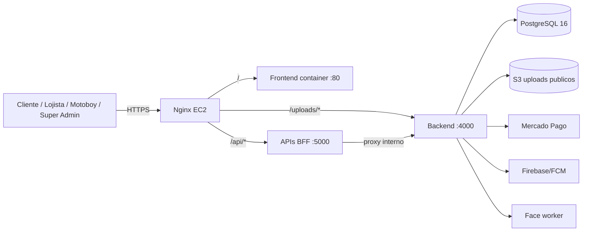

# Ja no Caminho

Aplicacao web/mobile para marketplace local, pedidos, lojas, pagamentos, entregas por motoboy, condominios e destinos turisticos.

O projeto roda como monorepo e hoje tem quatro servicos principais em producao:

- **Frontend**: SPA React/Vite servida por nginx.
- **APIs BFF**: camada Express intermediaria em `apis/`, responsavel por rotas proprias e proxy para o backend.
- **Backend**: API Express/TypeORM em `backend/`, com regras de negocio, banco, pagamentos, uploads, jobs e webhooks.
- **Face worker**: worker Python para verificacao assistida de documentos de motoboy.

## Experiencias do produto

- **Cliente**: home do app, busca de lojas, carrinho, checkout, meus pedidos, acompanhamento publico e notificacoes.
- **Lojista/Admin**: dashboard, cardapio, fila de pedidos, produtos, pagamentos, motoboys, condominios e destinos.
- **Motoboy**: fila de entregas, entrega atual, ganhos, perfil, documentos e repasse/recebimento de gorjetas.
- **Super Admin**: gestao de lojas, planos, usuarios, KYC de motoboy, destinos, banners da home, seguranca e configuracoes globais.
- **Destinos turisticos**: cidades, chale/pousada, servicos locais, lojas que atendem hospedagens e convites comerciais.
- **Condominios**: vitrines por condominio/evento, lojas participantes e fluxo normal de pedido.

## Arquitetura atual


```mermaid
flowchart LR
  U[Cliente / Lojista / Motoboy / Super Admin] -->|HTTPS| N[Nginx EC2]
  N -->|/| F[Frontend container :80]
  N -->|/api/*| B[APIs BFF :5000]
  N -->|/uploads/*| A[Backend :4000]
  B -->|proxy interno| A
  A --> P[(PostgreSQL 16)]
  A --> S3[(S3 uploads publicos)]
  A --> MP[Mercado Pago]
  A --> FCM[Firebase/FCM]
  A --> FW[Face worker]
```

Fluxo importante:

- O frontend sempre chama rotas relativas em `/api/...`.
- O nginx entrega a SPA e encaminha `/api/*` para o BFF.
- O BFF fica em `apis/` e encaminha a maioria das rotas para `http://backend:4000/api`.
- O backend em `backend/` e o motor real de dados, migrations, jobs, uploads, pagamentos e webhooks.
- Arquivos publicos novos devem ir para S3 pelo fluxo de upload existente; nao adicionar novas imagens dinamicas em `frontend/public`.

## Estrutura de pastas

- `frontend/`: React + Vite, PWA/Capacitor, telas web/mobile, testes unitarios e Playwright.
- `apis/`: BFF Express, rotas intermediarias e proxy para o backend.
- `backend/`: API principal, TypeORM, migrations, entidades, jobs, uploads, Mercado Pago, MFA e push.
- `mobile/`: shell Android/Capacitor e build AAB quando houver mudanca nativa.
- `face-worker/`: FastAPI/Python para verificacao facial de documentos.
- `docs/`: documentacao operacional, QA, SQLs, handoff e guias de manutencao.
- `scripts/`: deploy, compose local, backup, release e utilitarios.
- `server/`: codigo legado de mapas; nao sobe no compose padrao atual.

## Banco e configuracoes

Banco principal: PostgreSQL.

Fontes versionadas do schema:

- `backend/schema.sql`: schema base.
- `backend/src/utils/runMigrations.ts`: evolucoes incrementais e DDL complementar.
- `backend/docs/database-schema.html`: documentacao HTML gerada do schema.

Configuracoes globais ficam em `site_settings`.

Chaves importantes:

- `home.config`: JSON dos banners da Home e Popup de Marketing.
- `trial_days`: dias de teste gratis padrao para loja.
- `founder_vip_enabled`: ativa/desativa a campanha VIP fundador.
- `founder_vip_store_limit`: limite de lojas contempladas pela campanha.
- `founder_vip_days`: dias concedidos na campanha.
- `founder_vip_label`: texto interno gravado na atribuicao da loja.
- `legal.terms` e `legal.lgpd`: textos legais exibidos ao usuario.

Guia SQL de manutencao:

- `docs/SQL_CONSULTAS_MANUTENCAO.md`

## Configuracao da Home

A home principal nao depende mais de banners hardcoded para configuracao operacional.

- Tela: `Super Admin > Configuracao da Home`.
- Persistencia: `site_settings.key = 'home.config'`.
- Estrutura: `homeBanners` com ate 4 banners e `marketingPopup`.
- Imagens: upload pelo backend para S3/public uploads.
- Fallback: se a configuracao nao existir ou estiver invalida, o app usa banners padrao temporarios para nao quebrar producao.

## Campanha VIP fundador

A campanha permite dar acesso VIP/teste estendido para as primeiras lojas cadastradas sem alterar o fluxo manual de VIP do Super Admin.

Configuracao atual esperada em `site_settings`:

```sql
INSERT INTO site_settings ("key", "value") VALUES
  ('founder_vip_enabled', 'true'),
  ('founder_vip_store_limit', '30'),
  ('founder_vip_days', '90'),
  ('founder_vip_label', 'Campanha fundador - 3 meses de acesso VIP')
ON CONFLICT ("key") DO UPDATE
SET "value" = EXCLUDED."value",
    updated_at = NOW();
```

Comportamento:

- A campanha so atua no cadastro de loja nova.
- O acesso e aplicado como assinatura `TRIAL` estendida, nao como `plan_exempt`.
- O VIP manual do Super Admin continua em `store_settings.plan_exempt`.
- A atribuicao fica em `store_settings.acquisition_attribution`.

## MFA e seguranca

MFA/TOTP usa:

- `mfa_settings`: configuracao MFA por dono (`USER`, `PLATFORM_ADMIN`, `CONDOMINIUM_USER`).
- `mfa_challenges`: desafios de login temporarios.
- `trusted_devices`: dispositivos confiaveis.

O tempo de "lembrar aparelho" vem de variavel de ambiente do backend, nao de `site_settings`.

Tabelas de seguranca adicionais:

- `customer_security_blocks`
- `customer_risk_events`
- `access_logs`
- `password_resets`
- `email_verifications`

## Push notifications

Tokens ficam separados por publico:

- Cliente logado/guest: `customer_push_tokens`.
- Motoboy: `motoboy_push_tokens`.
- Usuario de loja: `store_user_push_tokens`.

Sempre trate tokens como dado sensivel em logs e consultas; para manutencao, use `left(token, 16)` em vez de selecionar o token completo.

## Rodar local

Fluxo recomendado por servico:

```bash
cp backend/.env.docker.example backend/.env.docker
cp apis/.env.docker.example apis/.env.docker
sh scripts/compose-dev-backend.sh
sh scripts/compose-dev-apis.sh
sh scripts/compose-dev-frontend.sh
```

Stack completa quando a mudanca atravessar varios servicos:

```bash
sh scripts/compose-dev.sh
```

Servicos locais principais:

- Frontend: `http://localhost:8080`
- APIs BFF: `http://localhost:5000`
- Backend: `http://localhost:4000`
- Swagger backend: `http://localhost:4000/api/docs`
- PostgreSQL: `localhost:5432`
- pgAdmin: `http://localhost:5050`

## Testes e build

Backend:

```bash
cd backend
yarn test
npm run build
```

Frontend:

```bash
cd frontend
npm run test:unit
npm run test:e2e
npm run build
```

APIs BFF:

```bash
cd apis
npm run build
```

Mudancas de schema/migration exigem tambem:

```bash
sh scripts/compose-dev-backend.sh
docker compose --env-file .env.dev ps backend
docker logs janocaminho-backend --tail 80
cd backend && npm run docs:schema
```

## Deploy em producao

Deploy normal e feito por imagem GHCR.

Workflow de imagens:

- `.github/workflows/publish-ghcr.yml`
- Nome: `Publish Docker Images (GHCR)`

Workflow aprovado:

- `.github/workflows/deploy-production.yml`
- Nome: `Deploy to EC2 (Approval)`

Scripts preferenciais no servidor:

```bash
scripts/./deploy-release-api.sh
scripts/./deploy-release-apis.sh
scripts/./deploy-release-frontend.sh
```

Regra pratica:

- Mudou `backend/`: rodar `scripts/./deploy-release-api.sh`.
- Mudou `apis/`: rodar `scripts/./deploy-release-apis.sh`.
- Mudou `frontend/`: rodar `scripts/./deploy-release-frontend.sh`.
- Mudou mais de um servico: rodar os scripts dos servicos afetados ou aprovar o workflow de deploy com o escopo correto.
- Mudou script/compose/infra: pode precisar de `git pull` no servidor antes do deploy.

Fallback legado, somente se o fluxo por imagem falhar:

```bash
scripts/./deploy-api.sh
scripts/./deploy-frontend.sh
```

## Android / AAB

Gerar novo AAB somente quando houver mudanca nativa mobile, Capacitor, plugins, Manifest, Gradle, resources Android ou configuracao que exija novo binario.

Validacao esperada:

```bash
npm --prefix frontend run build
npm --prefix mobile run android:sync
mobile/android/gradlew.bat clean bundleRelease
```

Ao gerar AAB:

- Incrementar `versionCode`.
- Atualizar `versionName`.
- Informar caminho do `.aab` gerado.
- Preparar texto curto de novidades para o Google Play Console.

## Backups e integridade

O volume do Postgres e fixado por nome em `docker-compose.yml`:

- `POSTGRES_VOLUME_NAME` com default `edespetohub_postgres-data`.

Em producao, `docker-compose.prod.yml` trata o volume como externo para reduzir risco de perda acidental.

Scripts relevantes:

- `scripts/pg-backup-rotate.sh`: backup SQL gz com rotacao.
- `scripts/backup-config.sh`: backup de configuracoes runtime/SSM para S3 privado.

Exemplo de backup manual:

```bash
BACKUP_DIR=/home/ec2-user/backups/janocaminho MIN_INTERVAL_HOURS=4 KEEP_LATEST=1 sh /home/ec2-user/EdEspetoHub/scripts/pg-backup-rotate.sh
```

## Documentacao principal

- Guia SQL: `docs/SQL_CONSULTAS_MANUTENCAO.md`
- Hub de destinos: `docs/DESTINATION_HUB.md`
- Entregas: `docs/DELIVERY.md`
- Jobs backend: `docs/BACKEND_JOBS.md`
- Guia de testes: `docs/TESTING_GUIDE.md`
- Servidor de producao: `docs/SERVIDOR_PRODUCAO.md`
- Schema HTML: `backend/docs/database-schema.html`

## Regras de manutencao

- Nao refatorar rotas, autenticacao ou regras de negocio sem necessidade.
- Toda rota nova consumida pelo frontend precisa existir no BFF ou ser proxyada por ele.
- Toda regra de negocio persistente deve ficar no backend.
- Toda mudanca de schema deve atualizar `schema.sql`, `runMigrations.ts` quando aplicavel, e `backend/docs/database-schema.html`.
- Toda alteracao de backend deve terminar com `cd backend && yarn test`.
- Antes de commitar, revisar diff e evitar incluir arquivos gerados de build-info sem necessidade.
