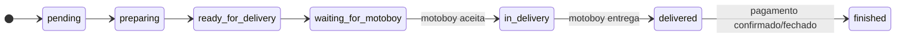
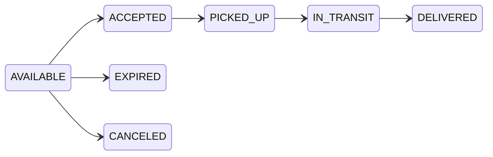

# Ja no Caminho

Aplicação web para pedidos e gestão de lojas/restaurantes (cardápio, checkout, fila e pagamentos), com módulo de entrega via motoboy.

O projeto traz quatro experiências principais:

- **Loja do cliente**: montagem e edição do pedido, info da loja no mobile (sheet), WhatsApp e link de acompanhamento (publico com persistencia via `localStorage`).
- **Painel interno (Admin/Churrasqueiro)**: dashboard com métricas, CRUD de produtos, fila do churrasqueiro (atualização a cada 5s), pagamentos e histórico.
- **Acompanhar pedido**: pagina publica em `/pedido/:orderId` com status, fila, detalhes e branding da loja.
  - Ultimos 3 pedidos publicos ficam em `localStorage` para reabrir o acompanhamento (inclusive mesa).
  - Numero exibido usa prefixo do slug (3 letras) + 8 primeiros chars do ID.
- **Promoções**: produto pode ter preço promocional ativo; vitrine, carrinho, fila e acompanhamento exibem valor original riscado + promocional.
- **Entregador (Motoboy)**: fila de entregas, entrega atual, histórico, ganhos e confirmação de pagamento no final da entrega.

## Guia do usuario

- Guia funcional web: `/guia`

## Estrutura de pastas

- `frontend/`: aplicação React + Vite (servida pelo nginx em produção).
- `backend/`: API Node.js/Express + TypeORM em TypeScript, com documentação Swagger em `/api/docs`.
- `server/`: microserviço de mapas (geocode/route) usado para ETA/distância.
- `face-worker/`: worker Python (FastAPI + DeepFace) para verificação assistida de selfie vs CNH.
- `docker-compose.yml`: sobe frontend, API, PostgreSQL e pgAdmin já apontando para as pastas certas.
- `docker-compose.prod.yml`: override de produção (principalmente segurança do volume do Postgres).
- `scripts/`: utilitários de deploy/backup/limpeza (`deploy-frontend.sh`, `deploy-api.sh`, `clean-safe.sh`, `compose-prod.sh`, `pg-backup-rotate.sh`).

## Padrao de documentacao (backend)

- Todo arquivo `backend/src/**/*.ts` deve conter o cabecalho CONFIDENTIAL com `@file`, `@Date` e `@author`.
- Classes e metodos no backend devem ter TSDoc em ingles com nome e data.
- Deixar uma linha em branco entre metodos.
- A data deve refletir a criacao do arquivo (git diff-filter=A).

## Visão geral do stack

- **Front-end**: React + Vite servido por nginx (`frontend/Dockerfile`).
- **API**: Node.js/Express/TypeORM (`backend/`).
- **Banco de dados**: PostgreSQL (schema base em `backend/schema.sql` + evolução via `backend/src/utils/runMigrations.ts`).
- **Maps**: microserviço `maps` (`server/`) para Google Routes/Geocoding.
- **Face verify**: worker `face-worker` para verificação assistida de documentos do motoboy (selfie vs CNH).

Requisitos mínimos para desenvolvimento local:

- Node.js 20+ e npm/yarn
- PostgreSQL 16+ (local) ou Docker
- Docker + Docker Compose (opcional, recomendado)

## Arquitetura (alto nível)

```mermaid
flowchart LR
  U[Cliente / Admin / Motoboy] -->|HTTPS| N[Nginx (EC2)]
  N -->|/| F[Frontend (nginx)]
  N -->|/api| A[API Node (Express)]
  N -->|/uploads| A
  A --> P[(Postgres)]
  A --> M[Maps service]
  A --> W[Face worker (Python)]
```

## Motoboy: KYC (plataforma) + vínculo (loja)

O cadastro do motoboy tem **duas camadas**:

1) **KYC global (plataforma)**: CNH/SELFIE/CRLV são validados pela equipe (SUPER_ADMIN) e/ou pela verificação assistida (face-worker).
2) **Vínculo por loja**: cada loja decide se aceita o motoboy na operação (aprovar/rejeitar vínculo), mas **não altera** o status global do documento.

Fluxo:

```mermaid
flowchart TD
  M[Motoboy] -->|envia docs| API[API]
  API -->|verifica selfie vs CNH| FW[face-worker]
  API -->|fila KYC| SA[SUPER_ADMIN]
  SA -->|aprova/rejeita docs| API
  M -->|solicita vínculo| API
  API -->|lista pendências+docs| LOJA[Loja (Admin)]
  LOJA -->|aprova vínculo (se KYC aprovado)| API
  LOJA -->|rejeita vínculo + pede reenvio| API
  API -->|motivo do reenvio| M
```

Regras principais:
- O motoboy pode **solicitar vínculo** assim que enviar os documentos obrigatórios (status pode estar `PENDING`).
- A loja só consegue **aprovar vínculo** quando o KYC global estiver **APROVADO** (SUPER_ADMIN).
- Se a loja precisar, ela pode **pedir reenvio** (com motivo) sem rejeitar o KYC global (pedido por loja via `metadata.review.storeReuploadRequests[storeId]`).

## Fluxo end-to-end (pedido + entrega)

Este é o fluxo esperado sem quebrar os fluxos antigos (retirada/mesa continuam iguais):

```mermaid
flowchart TD
  C[Cliente (vitrine)] -->|cria pedido| O[Order]
  O -->|Admin prepara| Q[Fila / Produção]
  Q -->|delivery: pronto| W[Aguardando entregador]
  W -->|motoboy aceita| D[Em rota]
  D -->|entregue| E[Entregue]
  E -->|confirma pagamento / finaliza| F[Finalizado]
```

Detalhes importantes:
- Motoboy só pode ter **1 entrega ativa** por vez.
- Dois motoboys não conseguem aceitar a mesma entrega (concorrência).
- Ao entrar em `Em rota`, o acompanhamento público do pedido mostra também **nome do motoboy** quando disponível.

### Endpoints principais

KYC (plataforma):
- `GET /api/admin/motoboys/kyc/pending` (SUPER_ADMIN)
- `GET /api/admin/motoboys/:motoboyId/documents` (SUPER_ADMIN)
- `POST /api/admin/motoboys/:motoboyId/documents/:documentId/approve` (SUPER_ADMIN)
- `POST /api/admin/motoboys/:motoboyId/documents/:documentId/reject` (SUPER_ADMIN)

Vínculo (loja):
- `POST /api/motoboy/store-requests` (motoboy)
- `GET /api/stores/:storeId/motoboy-requests` (ADMIN da loja)
- `POST /api/stores/:storeId/motoboy-requests/:requestId/approve` (ADMIN da loja)
- `POST /api/stores/:storeId/motoboy-requests/:requestId/reject` (ADMIN da loja)
- `POST /api/stores/:storeId/motoboys/:motoboyId/documents/:documentId/reupload` (ADMIN da loja)

## Rodar local com Docker Compose (recomendado)

```bash
cp backend/.env.docker.example backend/.env.docker
docker compose up --build
```

Serviços locais:
- Front-end: `http://localhost:8080`
- API: `http://localhost:4000` (Swagger em `/api/docs`)

## Produção: integridade do banco + backups

- O volume do Postgres é **pinned** por nome em `docker-compose.yml`:
  - `POSTGRES_VOLUME_NAME` (default: `edespetohub_postgres-data`)
- Em produção, `docker-compose.prod.yml` marca o volume como **external**, evitando perda acidental com `docker compose down -v`.
- A API tem bootstrap que recria o banco caso ele tenha sido dropado (e aplica `schema.sql` + migrations) para o serviço não ficar indisponível.

Backup/rotação (SQL gz) via script:

- `scripts/pg-backup-rotate.sh`
  - `MIN_INTERVAL_HOURS` (default `48`)
  - `KEEP_LATEST` (default `1`)

Exemplo (cron a cada 4h, mantendo apenas 1 arquivo):

```bash
BACKUP_DIR=/home/ec2-user/backups/janocaminho MIN_INTERVAL_HOURS=4 KEEP_LATEST=1 bash /home/ec2-user/EdEspetoHub/scripts/pg-backup-rotate.sh
```

## Rodar local sem Docker

1) **Instalar dependências**

```bash
cd backend && npm install
cd ../frontend && npm install
```

2) **Banco local**

```bash
createdb espetinho
psql -h localhost -U postgres -d espetinho -f backend/schema.sql
```

3) **Configurar envs**

```bash
cp backend/.env.example backend/.env
```

Edite `backend/.env` e ajuste `PG*`, `PORT` e `JWT_SECRET`.
Opcional: `LOG_LEVEL=debug|info|warn|error`, `LOG_TO_FILE=true` e `LOG_DIR=logs` para controlar logs e salvar em arquivo.

Opcional (producao): usar AWS SSM Parameter Store (SecureString) com um JSON unico. Configure:
- `SSM_PARAMETER_NAME` (ex: `/janocaminho/prod`)
- `AWS_REGION` (ex: `us-east-1`)
- `SSM_OVERRIDE=true` para sobrescrever variaveis locais
Opcional (dev local): se o SSM vier com `PGHOST=postgres`, defina `SSM_LOCAL_DB_HOST=localhost` para sobrescrever apenas no host (fora do Docker).
Opcional (debug): `SSM_LOG_KEYS=true` para logar quais chaves foram aplicadas (somente nomes).
Opcional (debug): `SSM_LOG_OVERRIDES=false` para ocultar overrides locais (padrao loga).

Exemplo de JSON no SSM:
```json
{
  "JWT_SECRET": "secret",
  "APP_BASE_URL": "https://www.janocaminho.com.br",
  "PGHOST": "db.prod",
  "PGPORT": "5432",
  "PGUSER": "postgres",
  "PGPASSWORD": "senha",
  "PGDATABASE": "espetinho",
  "DB_POOL_MAX": "10",
  "DB_POOL_IDLE_TIMEOUT_MS": "30000",
  "DB_POOL_CONNECTION_TIMEOUT_MS": "5000",
  "DB_STATEMENT_TIMEOUT_MS": "15000",
  "DB_IDLE_IN_TRANSACTION_TIMEOUT_MS": "10000",
  "MP_ACCESS_TOKEN": "xxx",
  "MP_PUBLIC_KEY": "xxx",
  "MP_WEBHOOK_SECRET": "xxx",
  "SMTP_HOST": "smtp.seu-dominio.com",
  "SMTP_PORT": "587",
  "SMTP_USER": "usuario",
  "SMTP_PASS": "senha",
  "SMTP_SECURE": "false",
  "EMAIL_FROM": "Jano Caminho <contato@janocaminho.com.br>"
}
```

Verificacao rapida:
- `aws ssm get-parameter --name /janocaminho/prod --with-decryption --region us-east-2`
- Ao subir a API, procure o log `SSM env loaded` (mostra o nome do parametro e a quantidade de chaves).

Crie `frontend/.env`:

```bash
VITE_API_BASE_URL=http://localhost:4000/api
```

4) **Subir**

```bash
cd backend && npm run dev
cd ../frontend && npm run dev
```

Serviços locais:
- Front-end: `http://localhost:3000`
- API: `http://localhost:4000`

## Mapas e Geocoding

### Stack atual
- Mapa da loja: OpenStreetMap embed no frontend.
- Geocoding: OpenStreetMap/Nominatim via backend principal.
- Rota/ETA: estimativa local no backend para evitar custo e dependência externa.

### Endpoints locais
- `POST /api/maps/geocode` → `{ lat, lng, formattedAddress }`
- `POST /api/maps/route` → `{ distanceKm, durationMin, estimated }`

### Variaveis de ambiente

Frontend (`frontend/.env`):
```
VITE_STORE_ORIGIN_LAT=-23.55052
VITE_STORE_ORIGIN_LNG=-46.633308
VITE_STORE_ORIGIN_LABEL=Loja
```

Backend (`backend/.env.docker`):
```
ENABLE_FREE_GEOCODING_FALLBACK=false
DEFAULT_PREP_MINUTES=15
DEFAULT_PREP_PER_ITEM_MINUTES=2
DEFAULT_QUEUE_MINUTES_PER_ORDER=5
DEFAULT_QUEUE_BUFFER_MINUTES=0
DEFAULT_ETA_BUFFER_MINUTES=3
```

### Rodar local

```bash
npm install
cd backend && npm install
cd ../frontend && npm install
cd ..
npm run dev
```

Rotas:
- Front: `http://localhost:3000`
- API: `http://localhost:4000`

### Producao
- O proxy `/api/maps` aponta para a API principal.
- O serviço Docker `maps` foi aposentado.
- Para subir tudo: `docker compose --env-file .env.prod up --build -d`.

## Modulo de entrega + motoboy (novo)

### O que entrou (sem quebrar o que ja existe)
- Fluxo de delivery com motoboy (atribuir, aceitar, entregar e confirmar pagamento).
- Status de pedido (apenas `type='delivery'`, no `orders.status`):
  - `pending` → `preparing` → `ready_for_delivery` → `waiting_for_motoboy` → `in_delivery` → `delivered` → `finished`
- Campos de pagamento em `orders`:
  - `payment_method` (pix/credito/debito/dinheiro)
  - `payment_status` (`PENDING` | `PAID`)
  - `cash_tendered` (dinheiro: quanto o cliente informou que vai pagar)
- Novas tabelas:
  - `motoboys`
  - `motoboy_stores`
  - `order_deliveries`
  - `delivery_events` (auditoria de transições)

### Regras principais
- Motoboy so ve pedidos das lojas associadas (N:N).
- Motoboy so atua se `motoboys.status = ACTIVE`.
- Pagamento em dinheiro/cartao fica `PENDING` ate o motoboy confirmar.
- Aceite de pedido e feito com transacao (conflito 409 se ja aceito).
- Exclusividade: 1 entrega ativa por motoboy (garantido por índice parcial no Postgres).
- Concorrência: dois motoboys não aceitam o mesmo pedido (apenas 1 vence; outro recebe 409).
- Expiração: entradas de fila expiram por `expires_at`, mas se o pedido continuar `waiting_for_motoboy`, a fila reabre automaticamente como `AVAILABLE`.

### Fluxo (status do pedido vs status da entrega)


```mermaid
stateDiagram-v2
  direction LR
  [*] --> pending
  pending --> preparing
  preparing --> ready_for_delivery
  ready_for_delivery --> waiting_for_motoboy
  waiting_for_motoboy --> in_delivery : motoboy aceita
  in_delivery --> delivered : motoboy entrega
  delivered --> finished : pagamento confirmado/fechado
```

`order_deliveries.status` (workflow da entrega):


```mermaid
stateDiagram-v2
  direction LR
  AVAILABLE --> ACCEPTED
  ACCEPTED --> PICKED_UP
  PICKED_UP --> IN_TRANSIT
  IN_TRANSIT --> DELIVERED
  AVAILABLE --> EXPIRED
  AVAILABLE --> CANCELED
```

### Endpoints (novos)
Motoboy:
- `GET /motoboy/orders/available`
- `GET /motoboy/orders/current`
- `GET /motoboy/orders/history`
- `GET /motoboy/earnings/today`
- `GET /motoboy/stats?range=day|week|month`
- `POST /motoboy/orders/:orderId/accept`
- `POST /motoboy/orders/:orderId/pickup`
- `POST /motoboy/orders/:orderId/start`
- `POST /motoboy/orders/:orderId/confirm-payment`
- `POST /motoboy/orders/:orderId/delivered`
- `POST /motoboy/orders/:orderId/finish`
- `GET /motoboy/profile`
- `PUT /motoboy/profile`
- `GET /motoboy/documents`
- `POST /motoboy/documents`

Conteudo legal (publico):
- `GET /legal/terms`
- `GET /legal/lgpd`

Admin (SUPER_ADMIN):
- `POST /admin/site-settings` (key/value)

Chaves uteis em `site_settings`:
- `legal.terms`
- `legal.lgpd`
- `email_templates.store_verification.subject|text|html`
- `email_templates.motoboy_verification.subject|text|html`
- `email_templates.password_reset.subject|text|html`
- `email_templates.activation.subject|text|html`
- `email_templates.subscription_reminder.subject|text|html`

Responsavel (dono da loja):
- `POST /stores/:storeId/motoboys`
- `POST /stores/:storeId/motoboys/:motoboyId/link`
- `POST /stores/:storeId/motoboys/:motoboyId/unlink`
- `POST /stores/:storeId/motoboys/:motoboyId/approve`
- `POST /stores/:storeId/motoboys/:motoboyId/suspend`

### Compatibilidade
- Nenhum endpoint antigo foi removido.
- Campos novos sao opcionais.
- `orders.payment_status` tem default `PENDING`.

## Verificação assistida de documentos (CNH + Selfie)

Quando o motoboy envia CNH e Selfie, o sistema pode rodar uma verificação automática **assistida** (não é prova de identidade):

- Selfie deve ter **exatamente 1 rosto**
- Tenta detectar rosto na CNH e comparar
- Salva resultado em `motoboy_documents.metadata.face`
- Admin vê badge `Alta/Média/Baixa/Indisponível` e revisa manualmente
- Política de tentativas: configurável por ambiente (default 10 em 24h)
- Para reduzir falso negativo, rejeição automática ocorre após falhas consecutivas (default 2)

Detalhes completos em: `docs/FACE_VERIFY.md`

Configuração recomendada no `.env.prod` (API):

```bash
FACE_VERIFY_ENABLED=true
FACE_VERIFY_WORKER_URL=http://face-worker:8000
FACE_VERIFY_TIMEOUT_MS=90000
FACE_VERIFY_SCORE_MEDIUM=0.55
FACE_VERIFY_SCORE_HIGH=0.75
FACE_VERIFY_MAX_ATTEMPTS=10
FACE_VERIFY_COOLDOWN_HOURS=24
FACE_VERIFY_REJECT_AFTER_CONSECUTIVE=2
FACE_VERIFY_REJECT_APPROVED=false
FACE_VERIFY_JOB_ENABLED=true
FACE_VERIFY_JOB_INTERVAL_MS=30000
```

## Criar primeira loja (seed de planos)

```bash
curl http://localhost:4000/api/plans
```

## Fluxo de criacao de conta (resumo)

1) Front envia `POST /api/auth/register` com dados do usuario (CPF/CNPJ), endereco com CEP e aceite de termos/LGPD.
2) API cria usuario (email nao verificado), gera slug unico, cria loja `open=false`.
3) Envia e-mail de confirmacao e redireciona para `/verify-email`.
4) Ao confirmar, o pagamento e criado e fica disponivel em `/payment/:id`.
5) E-mail de pagamento pendente e enviado com o link/QR.
5) Quando o MP aprova, o webhook confirma o pagamento, ativa a assinatura e abre a loja.
6) E-mail de ativacao e enviado com links do admin e da vitrine.

Cadastro (UX):
- Termos/LGPD aparecem em modal no `/create` e bloqueiam o envio se nao forem aceitos.
- CEP consulta ViaCEP para preencher endereco.

Assinaturas:
- Job diario marca expiracao e envia avisos em D-3, D-1 e D-0.
- Renovacao ocorre pelo painel `/admin/renewal` com escolha de plano.
- Pagamentos expirados/failed geram novo link ao renovar.

SEO basico:
- `robots.txt` aponta para o sitemap.
- `sitemap.xml` com rotas publicas basicas (home, create, terms).

Trial:
- Periodo gratis configuravel via `site_settings` (`trial_days`).
- Loja ativa apos confirmacao de e-mail, sem cobrar durante o trial.

Vitrine (mobile):
- Header compacto com botao "Info" da loja.
- Sheet com endereco, WhatsApp, Instagram e horarios.
- Mapa estatico gratuito via OpenStreetMap.

Configurações (admin):
- Identidade visual da loja (logo, descrição, cores).
- Canais de pagamento (chave Pix) e e-mail de contato da loja.

Demo:
- Alias legado de vitrine em `/chamanoespeto/:storeSlug` ainda existe para compatibilidade, mas o dominio e marca oficiais sao Ja no Caminho.
- Admin demo em `/admin/demo` com dados locais.

## Super admin

- Tela: `http://localhost:3000/superadmin`
- Autenticacao usa a tabela `platform_admins` (nao usa mais variavel de ambiente).
- Usuario seed inicial e criado em `schema.sql` e `runMigrations`.
- Para ambiente real, altere a senha bootstrap logo apos a primeira subida.


```mermaid
flowchart TD
  subgraph Cadastro_e_Pagamento
    A[Cadastro /api/auth/register] --> B[Criar usuario]
    B --> C[Gerar slug unico]
    C --> D[Criar loja open=false]
    D --> E[Assinatura PENDING]
    E --> F[Gerar pagamento MP]
    F --> G[Enviar email confirmacao]
    G --> H[Confirmar e-mail /verify-email]
    H --> I[Enviar email pagamento pendente]
    I --> J[Redirect /payment/:id]
    J --> K[Webhook MP aprovado]
    K --> L[Confirmar pagamento]
    L --> M[Assinatura ACTIVE + datas]
    M --> N[Loja open=true]
    N --> O[Enviar email de ativacao]
  end
  subgraph Pedido_e_Operacao
    P[Cliente acessa loja online] --> Q[Abrir loja pelo slug]
    Q --> R[Montar e revisar pedido]
    R --> S[Enviar pedido]
    S --> T[Validar loja]
    T --> U[Validar itens e calcular total]
    U --> V{Pedido valido?}
    V -->|Rejeitado| R
    V -->|Aprovado| W[Persistir pedido e itens]
    W --> X[Expor pedido na fila]
    X --> Y{Pedido criado por admin?}
    Y -->|Nao| Z[Receber resumo + link]
    Y -->|Sim| AA[Voltar para o cardapio]
  end
```

Arquivos BPMN (layout legivel por lanes):
- `docs/bpmn/chama-no-espeto-signup.bpmn`
- `docs/bpmn/chama-no-espeto-orders.bpmn`

## Checklist de QA (fluxos principais)

Cadastro e planos:
- Criar conta com e-mail válido, confirmar e-mail, entrar no admin.
- Trial de 7 dias: não gera pagamento; expirando bloqueia loja e exige renovação.
- Renovar assinatura: só mostra planos pagos; gerar Pix/Cartão/Boleto conforme plano.
- Pagamento expirado/failed: gera novo pagamento (não reutiliza link vencido).

Vitrine / pedido:
- Buscar item por nome, filtrar por categoria e adicionar no carrinho.
- Produto com promoção: exibe original riscado + promo em verde (cardápio e carrinho).
- Mesa ocupada: impedir novo pedido e mostrar aviso.
- Pedido enviado: abre acompanhamento e salva últimos 3 pedidos no `localStorage`.

Acompanhamento:
- Status em linha única (Recebido/Em preparo/Pronto/Pago).
- Exibe QR Pix apenas para cliente (cópia disponível).
- Voltar leva para a loja do slug correto.

Fila do churrasqueiro:
- Cards compactos, ordem de fila e tempo corrido.
- Promoção: mostrar preço original riscado + promo em verde.
- “Iniciar preparo” antes de “Marcar pronto”.
- Finalizados hoje com paginação e contagem.

Configurações:
- Atualizar logo/descrição/cores e validar persistência.
- Alterar chave Pix e e-mail de contato (limpar campo deve salvar vazio).

## Deploy no EC2 (resumo rapido)

Fluxo recomendado de deploy:

```bash
git pull
./scripts/deploy-frontend.sh
./scripts/deploy-api.sh
```

O script `deploy-frontend.sh` atualiza automaticamente no `.env.prod`:
- `FRONTEND_BUILD_VERSION`
- `FRONTEND_BUILD_GIT_SHA`
- `FRONTEND_BUILD_GIT_SHORT_SHA`
- `FRONTEND_BUILD_GIT_BRANCH`
- `FRONTEND_BUILD_TIME_ISO`

Isso garante que o rodapé/console de versões mostrem exatamente a build em produção.

Postgres (producao):
- Defina `POSTGRES_VOLUME_NAME` em `.env.prod` para fixar o volume e evitar "sumir o banco" ao mudar pasta/projeto.
- O deploy via `scripts/compose-prod.sh` usa `docker-compose.prod.yml` e trata o volume do Postgres como **external** (nao e removido por `docker compose down -v`).

### PostgreSQL: pool de conexoes da API

A API usa TypeORM com `pg` e agora o pool de conexoes com o PostgreSQL e configuravel por ambiente. Isso evita que a API abra conexoes demais em pico, reaproveita conexoes existentes e coloca limite de tempo para consultas ou transacoes travadas.

Configuracao usada em producao:

```json
{
  "DB_POOL_MAX": "10",
  "DB_POOL_IDLE_TIMEOUT_MS": "30000",
  "DB_POOL_CONNECTION_TIMEOUT_MS": "5000",
  "DB_STATEMENT_TIMEOUT_MS": "15000",
  "DB_IDLE_IN_TRANSACTION_TIMEOUT_MS": "10000"
}
```

O que cada variavel faz:

- `DB_POOL_MAX`: maximo de conexoes abertas por **cada container da API**. O padrao do projeto e `10`.
- `DB_POOL_IDLE_TIMEOUT_MS`: tempo para fechar conexao ociosa no pool. `30000` = 30 segundos.
- `DB_POOL_CONNECTION_TIMEOUT_MS`: tempo maximo esperando uma conexao livre antes de falhar. `5000` = 5 segundos.
- `DB_STATEMENT_TIMEOUT_MS`: tempo maximo de uma query no PostgreSQL. `15000` = 15 segundos.
- `DB_IDLE_IN_TRANSACTION_TIMEOUT_MS`: tempo maximo de uma transacao parada/aberta sem executar nada. `10000` = 10 segundos.

Por que isso melhora a performance percebida:

- Reduz criacao/destruicao desnecessaria de conexoes.
- Evita que picos de acesso derrubem o banco abrindo conexoes sem limite.
- Faz queries travadas falharem mais rapido, liberando recurso para os proximos pedidos.
- Ajuda a API a responder de forma mais previsivel quando o volume de usuarios aumenta.

Importante: isso melhora estabilidade e tempo de resposta, mas nao aumenta a capacidade do banco sozinho. Se o trafego crescer muito, ainda precisa monitorar CPU, memoria, I/O, queries lentas e tamanho do Postgres.

#### Como calcular com mais de uma API

`DB_POOL_MAX` vale por instancia/container. Entao o total reservado pela API e:

```txt
total_api_connections = quantidade_de_apis * DB_POOL_MAX
```

Com Postgres em `max_connections = 100`, reserve conexoes para pgAdmin, scripts, backups, migrations e acesso manual. Uma regra segura:

```txt
quantidade_de_apis * DB_POOL_MAX <= max_connections - 20
```

Exemplos:

| Instancias de API | DB_POOL_MAX | Conexoes maximas da API |
| --- | ---: | ---: |
| 1 | 10 | 10 |
| 2 | 10 | 20 |
| 4 | 10 | 40 |
| 4 | 20 | 80 |

Para uma EC2 pequena e um unico Postgres, comece com `DB_POOL_MAX=10`. Se criar mais containers da API, mantenha `10` ou reduza por instancia antes de aumentar. So aumente quando o banco tiver folga real e houver evidencia de fila esperando conexao.

#### Onde configurar em producao

Em producao, esses valores ficam no AWS SSM Parameter Store dentro do JSON do parametro do ambiente, por exemplo `/chamanoespeto/prod` ou `/janocaminho/prod`.

Exemplo para conferir o valor atual:

```bash
aws ssm get-parameter \
  --name /chamanoespeto/prod \
  --with-decryption \
  --region us-east-2 \
  --query Parameter.Value \
  --output text
```

Depois de alterar o SSM, recrie a API para ela reler as variaveis:

```bash
git pull
./scripts/deploy-api.sh
```

O script `deploy-api.sh` constroi o codigo local que esta no EC2 depois do `git pull`, recria o container da API com `--force-recreate` e mostra o commit local que esta sendo implantado.

#### Como validar no servidor

Conferir se as variaveis chegaram dentro do container:

```bash
docker exec chamanoespeto-api sh -lc 'node -e "console.log({
  DB_POOL_MAX: process.env.DB_POOL_MAX,
  DB_POOL_IDLE_TIMEOUT_MS: process.env.DB_POOL_IDLE_TIMEOUT_MS,
  DB_POOL_CONNECTION_TIMEOUT_MS: process.env.DB_POOL_CONNECTION_TIMEOUT_MS,
  DB_STATEMENT_TIMEOUT_MS: process.env.DB_STATEMENT_TIMEOUT_MS,
  DB_IDLE_IN_TRANSACTION_TIMEOUT_MS: process.env.DB_IDLE_IN_TRANSACTION_TIMEOUT_MS
})"'
```

Conferir conexoes no Postgres:

```bash
docker exec chamanoespeto-postgres psql -U postgres -d espetinho -c "show max_connections;"
docker exec chamanoespeto-postgres psql -U postgres -d espetinho -c "select state, count(*) from pg_stat_activity group by state order by state;"
```

Limpeza segura de disco (quando der ENOSPC):

```bash
./scripts/clean-safe.sh
# opcional (também limpa logs do systemd):
./scripts/clean-safe.sh --with-logs
```

Preparar segredos (opcional/recomendado):

```bash
cp .env.prod.secrets.example .env.prod.secrets
# edite os valores reais
```

Backup:
```bash
sh scripts/pg-backup.sh
```

Backup com rotacao (recomendado em producao com pouco disco):
```bash
sh scripts/pg-backup-rotate.sh
```

Exemplo de cron (executa a cada 4h, faz dump quando vencida a janela e remove o anterior):
```bash
sudo crontab -e
# adicionar:
# 0 */4 * * * BACKUP_DIR=/var/backups/janocaminho MIN_INTERVAL_HOURS=4 KEEP_LATEST=1 sh /caminho/para/repo/scripts/pg-backup-rotate.sh >> /var/log/pg-backup.log 2>&1
```

Verificar crontab e ultimos backups:
```bash
sudo crontab -l
ls -lah /var/backups/janocaminho
```

4) Verificacao rapida:

```bash
docker ps
docker exec -it janocaminho-api env | grep -E '^(MP_|SMTP_|EMAIL_FROM|APP_BASE_URL)'
curl -s https://www.janocaminho.com.br/api/docs.json | head -n 1
```

5) Teste de e-mail (reset de senha):

```bash
curl -X POST https://www.janocaminho.com.br/api/auth/forgot-password \
  -H "Content-Type: application/json" \
  -d '{"email":"seu-email@gmail.com"}'
```

6) Webhook MP (checagem rapida):

```bash
docker logs janocaminho-api --tail 200 | grep -i "mercadopago\\|webhook"
```

## Versionamento e Release

Padrão adotado no projeto: **SemVer** (`MAJOR.MINOR.PATCH`).

- `patch`: correções sem quebra (ex: `1.2.3` -> `1.2.4`)
- `minor`: recurso novo compatível (ex: `1.2.3` -> `1.3.0`)
- `major`: mudança com quebra (ex: `1.2.3` -> `2.0.0`)

Comandos:

```bash
npm --prefix frontend run release:patch
npm --prefix frontend run release:minor
npm --prefix frontend run release:major
```

Cada release:
- incrementa `frontend/package.json`
- regenera `src/generated/buildInfo.ts`
- cria commit `chore(release): vX.Y.Z`
- cria tag git `vX.Y.Z`
- faz push + push das tags

Em todo deploy comum, o `buildId` também muda (timestamp + hash), mesmo sem mudar `vX.Y.Z`.

## Teste de fluxo (manual assistido)

O script `scripts/test-flow.sh` cria usuario, confirma e-mail e valida login admin.
Requer `jq` instalado e o token de confirmacao copiado do e-mail.

```bash
sh scripts/test-flow.sh
```

Nginx como reverse proxy:

- Use `docs/nginx/janocaminho.conf` ou o arquivo equivalente atual do ambiente
- `/` -> `http://127.0.0.1:8080`
- `/api/` -> `http://127.0.0.1:4000/api/`
- `/uploads/` -> `http://127.0.0.1:4000/uploads/`
- `client_max_body_size 20m`

HTTPS:

```bash
sudo certbot --nginx -d janocaminho.com.br -d www.janocaminho.com.br
```

Mercado Pago (producao):

- A plataforma usa duas camadas de Mercado Pago:
  - **Conta da plataforma**: usada para cobrança de planos, renovações e destaques.
  - **Conta do lojista via OAuth**: opcional, usada para cobrar pedidos da própria loja em Pix, crédito e débito.
- Se a loja não conectar o Mercado Pago dela, o checkout continua no modo convencional: o pedido registra a forma de pagamento escolhida, mas a cobrança é feita fora do sistema.
- Se a loja conectar, novos pedidos com `pix`, `credito` ou `debito` criam registro em `order_payments` e tentam gerar cobrança no Mercado Pago do lojista.

Variáveis necessárias:

```env
APP_BASE_URL=https://www.janocaminho.com.br
MP_ACCESS_TOKEN=<access-token-da-plataforma>
MP_PUBLIC_KEY=<public-key-da-plataforma>
MP_WEBHOOK_URL=https://www.janocaminho.com.br/api/webhooks/mercadopago
MP_WEBHOOK_SECRET=<secret-do-webhook>
MP_API_BASE_URL=https://api.mercadopago.com
MP_DEBUG=false

# OAuth para lojistas
MP_CLIENT_ID=<client-id-da-aplicacao-mercado-pago>
MP_CLIENT_SECRET=<client-secret-da-aplicacao-mercado-pago>
MP_OAUTH_REDIRECT_URL=https://www.janocaminho.com.br/api/payment-accounts/mercadopago/callback
MP_OAUTH_ENCRYPTION_KEY=<hex-64-caracteres>
```

Em producao, preferimos guardar esses valores no AWS SSM Parameter Store (`SecureString`) dentro do JSON do parametro, por exemplo `/janocaminho/prod` ou `/chamanoespeto/prod`, conforme o ambiente. Para conferir o SSM:

```bash
aws ssm get-parameter \
  --name /janocaminho/prod \
  --with-decryption \
  --region us-east-2
```

Para gerar uma chave de criptografia OAuth localmente:

```bash
node -e "console.log(require('crypto').randomBytes(32).toString('hex'))"
```

Configuracao no painel do Mercado Pago:

1. Acesse a aplicacao no painel de desenvolvedor do Mercado Pago.
2. Em produto integrado, use pagamentos online com Checkout Transparente/API Pagamentos conforme a integracao atual.
3. Em configuracao avancada/OAuth, cadastre exatamente:

```text
https://www.janocaminho.com.br/api/payment-accounts/mercadopago/callback
```

4. Se houver opcao de PKCE para OAuth, manter desativado enquanto o backend usar o fluxo atual com `client_secret`.
5. Permissoes esperadas: `read`, `write` e `offline_access`.
6. Configure o webhook de producao para:

```text
https://www.janocaminho.com.br/api/webhooks/mercadopago
```

Rotas implementadas:

- `GET /api/stores/:storeId/payment-accounts/mercadopago` verifica status da conexao da loja.
- `POST /api/stores/:storeId/payment-accounts/mercadopago/connect` gera a URL de autorizacao OAuth.
- `GET /api/payment-accounts/mercadopago/callback` recebe o `code`, troca por token e salva a conta conectada.
- `DELETE /api/stores/:storeId/payment-accounts/mercadopago` desconecta e volta a loja para o modo convencional.

Tabelas usadas:

- `store_payment_accounts`: guarda a conexao OAuth da loja, com tokens criptografados.
- `order_payments`: guarda as tentativas/cobrancas online criadas para pedidos.

Ponto importante de inicializacao da API:

- O SSM precisa ser carregado antes de qualquer import que leia `config/env`.
- Se `MP_CLIENT_ID` e `MP_CLIENT_SECRET` estiverem no SSM, mas o painel mostrar OAuth nao configurado, recrie o container da API e confira se a imagem contem o carregamento correto.

Verificacao rapida dentro do container:

```bash
docker exec chamanoespeto-api node - <<'NODE'
(async () => {
  const { loadSsmEnv } = require('./dist/config/ssm');
  await loadSsmEnv();
  const { env } = require('./dist/config/env');
  console.log({
    appUrl: env.appUrl,
    clientId: env.mercadoPago.clientId,
    redirect: env.mercadoPago.oauthRedirectUrl,
    hasSecret: Boolean(env.mercadoPago.clientSecret),
    hasEncryptionKey: Boolean(env.mercadoPago.encryptionKey),
    webhookUrl: env.mercadoPago.webhookUrl,
  });
})();
NODE
```

Teste da conexao no navegador, logado como lojista/admin:

```js
const s = JSON.parse(localStorage.getItem('adminSession') || '{}');

fetch(`/api/stores/${s.store.id}/payment-accounts/mercadopago`, {
  headers: { Authorization: `Bearer ${s.token}` },
})
  .then((r) => r.json())
  .then(console.log);
```

Resultado esperado quando a aplicacao OAuth esta configurada:

```json
{
  "connected": false,
  "status": "DISCONNECTED",
  "oauthConfigured": true
}
```

Depois que o lojista conectar, esperado:

```json
{
  "connected": true,
  "status": "CONNECTED",
  "oauthConfigured": true
}
```

Teste de pedido online:

1. Conecte a loja em **Financeiro > Pagamentos > Mercado Pago**.
2. Faça um pedido novo na loja escolhendo Pix, crédito ou débito.
3. Para Pix, a tela de sucesso deve exibir QR/link de pagamento.
4. Confira no banco:

```bash
docker exec -it chamanoespeto-postgres psql -U postgres -d espetinho -c \
"select id, store_id, payment_status, provider, provider_id, created_at from order_payments order by created_at desc limit 5;"
```

Para voltar ao modo convencional:

1. No painel do lojista, acesse **Financeiro > Pagamentos**.
2. Clique em **Desconectar e voltar ao modo convencional**.
3. A loja deixa de criar cobrancas online; Pix, crédito e débito voltam a ser apenas informacao no pedido.

Nginx/HTTPS:

- O webhook e o OAuth exigem HTTPS valido.
- `janocaminho.com.br` e `www.janocaminho.com.br` devem responder corretamente.
- Em producao, mantenha redirect HTTP para HTTPS e, preferencialmente, canonical para `https://www.janocaminho.com.br`.
- O callback deve chegar no Express. Este teste deve responder `302`, nao `404`:

```bash
curl -I https://www.janocaminho.com.br/api/payment-accounts/mercadopago/callback
```

Deploy apos mudar SSM ou imagem:

```bash
cd ~/EdEspetoHub
docker compose -f docker-compose.yml -f docker-compose.prod.yml --env-file .env.prod pull api frontend
docker compose -f docker-compose.yml -f docker-compose.prod.yml --env-file .env.prod up -d --no-deps --force-recreate api frontend
docker logs --tail 60 chamanoespeto-api
```

6) SMTP (exemplo Zoho):

```
SMTP_HOST=smtp.zoho.com
SMTP_PORT=587
SMTP_USER=contato@janocaminho.com.br
SMTP_PASS=<senha-ou-app-password>
SMTP_SECURE=false
EMAIL_FROM=Jano Caminho <contato@janocaminho.com.br>
```

Se configurar assinatura secreta no painel, defina `MP_WEBHOOK_SECRET` na API.

### O que é ngrok (explicação rápida)
ngrok cria um túnel público temporário para seu servidor local. Isso permite que o Mercado Pago envie o webhook para sua máquina local durante testes. Sempre que você reiniciar o ngrok, a URL pública muda (a menos que use um plano pago com URL fixa).

## Execução local (sem Docker)

### Fluxo rápido (local)

```bash
cp backend/.env.example backend/.env
docker start janocaminho-postgres
cd backend && npm run dev
```

Para o front:

```bash
cd frontend && npm run dev
```

### 1. Banco de dados

1. Crie um banco chamado `espetinho` e aplique o schema inicial (opcional, a API também cria tabelas on-demand):

    ```bash
    psql -h localhost -U postgres -d espetinho -f backend/schema.sql
    ```

2. Variáveis de conexão usadas pelo `pg` (padrões: `postgres` / `postgres`):

    ```bash
    export PGHOST=localhost
    export PGUSER=postgres
    export PGPASSWORD=postgres
    export PGDATABASE=espetinho
    ```

### 2. API (pasta `backend/`)

```bash
cd backend
npm install
npm run dev    # desenvolvimento com reload
npm run build  # gera dist/
npm start      # roda dist/app.js
```

A API sobe em `http://localhost:4000` e expõe a documentação Swagger em `http://localhost:4000/api/docs`. Durante a inicialização ela valida a conexão com o PostgreSQL usando as variáveis de ambiente listadas acima.

Endpoints principais:

- `POST /api/auth/register` — cria usuário, loja e retorna token JWT.
- `POST /api/auth/admin-login` — autenticação via slug + senha.
- `POST /api/auth/login` — autenticação via e-mail + senha.
- `GET /api/stores/:slug`, `PUT /api/stores/:id`, `PUT /api/stores/:id/status` — gerenciamento de loja.
- `GET /api/stores/:storeId/products`, `POST /api/stores/:storeId/products` — catálogo (admin).
- `GET /api/stores/slug/:slug/products` — catálogo público por loja (vitrine).
- `GET /api/stores/:storeId/orders`, `POST /api/stores/:storeId/orders` — pedidos e fila.
- `GET /api/orders/:orderId/public` — acompanhamento publico do pedido (status + dados da loja).
- `GET /api/v2/orders/:orderId/tracking` — tracking v2 com ETA total + breakdown (prep/fila/rota).

### ETA V2 (entrega total)

O sistema diferencia:

- **travelMinutes**: somente tempo de deslocamento (rota).
- **totalMinutes**: preparo + fila + deslocamento + buffer.

Para ativar no endpoint público atual (`/api/orders/:orderId/public`) sem quebrar payloads, use:

```
ENABLE_ORDER_ETA_V2=true
```

Quando habilitado, o `/api/orders/:orderId/public` passa a incluir o campo opcional `eta`.
O tracking completo está sempre disponível via `/api/v2/orders/:orderId/tracking`.

Variáveis de configuração (backend):

```
ENABLE_ORDER_ETA_V2=true
ENABLE_FREE_GEOCODING_FALLBACK=false
DEFAULT_PREP_MINUTES=15
DEFAULT_PREP_PER_ITEM_MINUTES=2
DEFAULT_QUEUE_MINUTES_PER_ORDER=5
DEFAULT_QUEUE_BUFFER_MINUTES=0
DEFAULT_ETA_BUFFER_MINUTES=3
```

Exemplo (v1) — **inalterado**:

```json
{
  "id": "order-id",
  "status": "pending",
  "type": "delivery",
  "total": 42.5,
  "queuePosition": 1,
  "queueSize": 3,
  "items": []
}
```

Exemplo (v1 + flag ENABLE_ORDER_ETA_V2):

```json
{
  "id": "order-id",
  "status": "pending",
  "type": "delivery",
  "total": 42.5,
  "queuePosition": 1,
  "queueSize": 3,
  "items": [],
  "eta": {
    "totalMinutes": 28,
    "windowMin": 22,
    "windowMax": 34,
    "breakdown": {
      "prepMinutes": 17,
      "queueMinutes": 5,
      "travelMinutes": 3,
      "bufferMinutes": 3
    },
    "travel": {
      "distanceKm": 1.4,
      "travelMinutes": 3
    },
    "confidence": "high",
    "algoVersion": "eta_v2.0"
  }
}
```

Exemplo (v2 tracking):

```json
{
  "id": "order-id",
  "status": "pending",
  "type": "delivery",
  "createdAt": "2026-01-28T12:00:00.000Z",
  "queuePosition": 1,
  "queueSize": 3,
  "timeline": [
    { "status": "pending", "at": "2026-01-28T12:00:00.000Z" }
  ],
  "eta": {
    "totalMinutes": 28,
    "windowMin": 22,
    "windowMax": 34,
    "prepMinutes": 17,
    "queueMinutes": 5,
    "travelMinutes": 3,
    "bufferMinutes": 3,
    "confidence": "high",
    "algoVersion": "eta_v2.0"
  },
  "travel": {
    "distanceKm": 1.4,
    "travelMinutes": 3
  }
}
```

### 3. Front-end React (pasta `frontend/`)

```bash
cd frontend
npm install
npm run dev
```

Crie um arquivo `.env` (ou use `.env.production`) na pasta `frontend/` com o endpoint da API:

```bash
VITE_API_BASE_URL=http://localhost:4000/api
```

SSM local (setup rapido):
- Veja `docs/ssm-local.md`

Com a API em execução, a loja fica acessível em:

- Vitrine (cliente): `http://localhost:3000/<slug>` (ex: `http://localhost:3000/lojadoedmilson`)
- Admin pedidos: `http://localhost:3000/admin/orders`
- Fila do churrasqueiro: `http://localhost:3000/admin/queue`
- Admin entregadores: `http://localhost:3000/admin/motoboys`
- Motoboy cadastro: `http://localhost:3000/motoboy/register`
- Motoboy login: `http://localhost:3000/motoboy/login`
- Motoboy pedidos disponíveis: `http://localhost:3000/motoboy/available`
- Motoboy entrega atual: `http://localhost:3000/motoboy/current`
- Motoboy histórico: `http://localhost:3000/motoboy/history`

### 4. pgAdmin (opcional, local)

- Host: `localhost`
- Porta: `5432`
- Usuário: `postgres`
- Senha: a que você definiu

## Execução com Docker

### Subir tudo com Docker Compose

Antes de subir, copie o arquivo de ambiente do Docker:

```bash
cp backend/.env.docker.example backend/.env.docker
```

```bash
docker compose up --build
```

Serviços expostos:

- Front-end: http://localhost:8080
- API: http://localhost:4000 (Swagger em `/api/docs`)
- PostgreSQL: porta 5432 (volume `postgres-data`)
- pgAdmin: http://localhost:5050

Rotas úteis no front (Docker):

- Vitrine (cliente): `http://localhost:8080/<slug>`
- Admin pedidos: `http://localhost:8080/admin/orders`
- Fila de produção: `http://localhost:8080/admin/queue`
- Admin entregadores: `http://localhost:8080/admin/motoboys`
- Motoboy cadastro: `http://localhost:8080/motoboy/register`
- Motoboy login: `http://localhost:8080/motoboy/login`
- Motoboy pedidos disponíveis: `http://localhost:8080/motoboy/available`
- Motoboy entrega atual: `http://localhost:8080/motoboy/current`
- Motoboy histórico: `http://localhost:8080/motoboy/history`

### Rodar com portas de produção (porta 80)

Crie um arquivo `.env.prod` com `FRONTEND_PORT=80` e suba assim:

```bash
docker compose --env-file .env.prod up --build -d
```

### Deploy atual no EC2: git pull + build local

No ambiente atual, o deploy nao depende de subir imagem no registry. O fluxo e entrar no EC2, atualizar o codigo pelo Git e recriar os containers necessarios:

```bash
git pull
./scripts/deploy-frontend.sh
./scripts/deploy-api.sh
```

O `deploy-api.sh` usa o codigo local recem-atualizado, executa `docker compose up -d --build --no-deps --force-recreate api` e imprime o commit que esta sendo implantado. Isso ajuda a confirmar que a API subiu com o codigo novo.

### Deploy sem build no servidor (fase 1, conservadora)

Em instâncias pequenas (ex: `t3.small`) o `docker compose up --build` pode travar o SSH por falta de CPU/RAM/créditos.
O caminho novo mantém o deploy antigo intacto, mas adiciona uma trilha paralela:

```text
git push -> GitHub Actions builda -> GHCR publica -> EC2 só faz pull + up -d
```

Fluxo:

1) Verifique se o workflow `.github/workflows/publish-ghcr.yml` rodou após o `git push`.
2) No servidor, mantenha `.env.prod` com:

- `IMAGE_REGISTRY=ghcr.io`
- `IMAGE_NAMESPACE=edmilsonfernandes`
- `IMAGE_TAG=main` ou uma SHA curta

3) Faça login no GHCR no servidor se o repositório for privado:

```bash
docker login ghcr.io
```

Ou configure em `.env.prod.secrets`:

```env
GHCR_USERNAME=<seu-usuario-github>
GHCR_TOKEN=<pat-com-read-packages>
```

Recomendado em produção: guardar `GHCR_USERNAME` e `GHCR_TOKEN` dentro do mesmo JSON `SecureString` já usado no SSM, por exemplo `/chamanoespeto/prod`, e apontar no `.env.prod`:

```env
AWS_REGION=us-east-2
SSM_PARAMETER_NAME=/chamanoespeto/prod
```

Se o seu `backend/.env.docker` já usa esse `SSM_PARAMETER_NAME`, o script de release agora também reaproveita esse arquivo e você não precisa duplicar a configuração no `.env.prod`.

4) Deploy por release específica ou pela `main` mais recente:

```bash
sh scripts/deploy-release-api.sh
sh scripts/deploy-release-frontend.sh

# ou travando em uma release específica
sh scripts/deploy-release-api.sh 3a254581
sh scripts/deploy-release-frontend.sh 3a254581
```

Ou tudo em um passo:

```bash
sh scripts/deploy-release.sh

# ou travando tag e serviços
sh scripts/deploy-release.sh 3a254581 api frontend face-worker
```

Fallback:
- Se esse fluxo novo falhar, o deploy antigo continua disponível:

```bash
./scripts/deploy-api.sh
./scripts/deploy-frontend.sh
```

5) Teste manual rápido no EC2:

```bash
cd ~/EdEspetoHub
git pull
```

Adicionar `GHCR_USERNAME` e `GHCR_TOKEN` dentro do JSON do parâmetro SSM já existente:

```bash
aws ssm get-parameter \
  --name "/chamanoespeto/prod" \
  --with-decryption \
  --region us-east-2 \
  --query 'Parameter.Value' \
  --output text
```

Permissões mínimas para a role/usuário AWS usado no EC2:
- `ssm:GetParameter`
- `kms:Decrypt`

Edite o JSON retornado e inclua:

```json
{
  "GHCR_USERNAME": "EdmilsonFernandes",
  "GHCR_TOKEN": "<pat-classic-com-read-packages>"
}
```

Depois grave o JSON completo de volta:

```bash
aws ssm put-parameter \
  --name "/chamanoespeto/prod" \
  --value '<JSON_COMPLETO_ATUALIZADO>' \
  --type SecureString \
  --overwrite \
  --region us-east-2
```

Se ainda não estiver definido em `backend/.env.docker`, aponte no `.env.prod`:

```bash
cat >> .env.prod <<'EOF'
AWS_REGION=us-east-2
SSM_PARAMETER_NAME=/chamanoespeto/prod
EOF
```

Testar acesso e deploy:

```bash
aws ssm get-parameter --name /chamanoespeto/prod --with-decryption --region us-east-2 --query 'Parameter.Value' --output text
docker pull ghcr.io/edmilsonfernandes/edespetohub-api:main
docker pull ghcr.io/edmilsonfernandes/edespetohub-frontend:main
docker pull ghcr.io/edmilsonfernandes/edespetohub-face-worker:main
sh scripts/deploy-release-api.sh
sh scripts/deploy-release-frontend.sh
docker ps
```

Se quiser, `.env.prod.secrets` continua funcionando como fallback local.

### Atalhos (scripts)

Execução local (porta 8080):

```bash
sh scripts/compose-dev.sh
```

Execução produção (porta 80):

```bash
sh scripts/compose-prod.sh
```

Execução produção opcional (pull-only, sem build):

```bash
sh scripts/compose-prod-pull.sh
```

Deploy por release pronta do GHCR:

```bash
sh scripts/deploy-release-api.sh
sh scripts/deploy-release-frontend.sh

# opcional: fixar uma release
sh scripts/deploy-release-api.sh <sha-curta>
sh scripts/deploy-release-frontend.sh <sha-curta>
```

Deploy direto por serviço (EC2):

```bash
./scripts/deploy-frontend.sh
./scripts/deploy-api.sh
```

Limpeza segura de disco:

```bash
./scripts/clean-safe.sh
```

Credenciais padrão do pgAdmin (pode sobrescrever via variáveis de ambiente ao subir): `admindatony@datony.com` / `Datony20025#!`.

### Atualizar schema (horário de funcionamento)

Para bancos existentes, a API aplica a migração automaticamente ao iniciar
(`opening_hours` e `social_links` em `store_settings`). Basta reiniciar a API.

Se quiser aplicar manualmente, use:

```sql
ALTER TABLE store_settings
ADD COLUMN IF NOT EXISTS opening_hours JSONB DEFAULT '[]';
```

Com Docker:

```bash
docker exec -i janocaminho-postgres psql -U postgres -d espetinho <<'SQL'
ALTER TABLE store_settings
ADD COLUMN IF NOT EXISTS opening_hours JSONB DEFAULT '[]';
SQL
```

Para um banco vazio, continue usando o `backend/schema.sql` (já contém a coluna nova).

### Imagens individuais

- **Front-end** (usa `frontend/Dockerfile` com nginx):

    ```bash
    cd frontend
    docker build -t espetinho-app .
    docker run --rm -p 80:80 espetinho-app
    ```

- **API** (usa `backend/Dockerfile`):

    ```bash
    cd backend
    docker build -t espetinho-api .
    docker run --rm -p 4000:4000 \
      -e PGHOST=<host> -e PGUSER=<usuario> -e PGPASSWORD=<senha> -e PGDATABASE=<db> \
      espetinho-api
    ```

- **PostgreSQL + schema**

    ```bash
    docker run --name espetinho-db -e POSTGRES_PASSWORD=postgres -e POSTGRES_DB=espetinho -p 5432:5432 -d postgres:16
    docker exec -i espetinho-db psql -U postgres -d espetinho < backend/schema.sql
    ```

- **pgAdmin**

    ```bash
    docker build -f Dockerfile.pgadmin -t espetinho-pgadmin .
    docker run --rm -p 5050:80 \
      -e PGADMIN_DEFAULT_EMAIL=admindatony@datony.com \
      -e PGADMIN_DEFAULT_PASSWORD=Datony20025#! \
      -v pgadmin-data:/var/lib/pgadmin \
      espetinho-pgadmin
    ```

## BPMN do fluxo da aplicação

Um diagrama BPMN resumindo o fluxo do "Ja no Caminho" esta disponivel em `docs/bpmn/chama-no-espeto.bpmn`. O arquivo segue o padrao BPMN 2.0 (pode ser aberto no Camunda Modeler, Draw.io ou semelhantes) e destaca:

- Jornada do cliente na loja pública (montagem e envio do pedido com Pix).
- Validação e criação do pedido pela API.
- Operação diária do painel interno (cadastro, catálogo, publicação da loja e fila do churrasqueiro).

## Notas adicionais

- Ao publicar em produção (ex.: EC2), exponha apenas as portas necessárias e substitua credenciais padrão.
- O diretório `.vscode/` traz recomendações de formatação (2 espaços, LF, remoção de espaços em branco e nova linha final), aplicadas automaticamente se o Prettier estiver instalado.
Vitrine e painel com Docker:

- Vitrine (cliente): `http://localhost:8080/<slug>` (ex: `http://localhost:8080/lojadoedmilson`)
- Admin pedidos: `http://localhost:8080/admin/orders`
- Fila do churrasqueiro: `http://localhost:8080/admin/queue`
