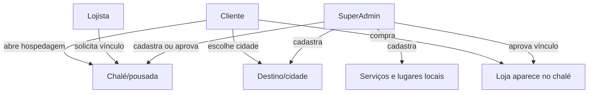

# Hub de destinos, chalés e pousadas

## Objetivo

Transformar o app em uma vitrine turística local, sem misturar cidades sem critério. O cliente escolhe uma cidade/destino, vê chalés e pousadas daquela região, encontra lojas que entregam naquela hospedagem e também descobre serviços e lugares para visitar.

## Como funciona

## Atores e responsabilidades

- **Plataforma/SuperAdmin**: cria cidades, banners, chalés, pousadas, serviços locais e aprova solicitações.
- **Chalé/pousada/prestador**: solicita entrada pelo formulário público `/destinos/cadastrar`; a plataforma revisa antes de publicar.
- **Lojista**: solicita participação em chalés/pousadas onde realmente entrega pela aba `Admin > Destinos`.
- **Cliente/turista**: navega por `/destinos`, escolhe cidade, hospedagem e loja/serviço.

## Quem cadastra os serviços

Serviço é qualquer item de curadoria do destino que não precisa ser uma loja com cardápio dentro do app: passeio, massagem, restaurante para visitar, atrativo, experiência noturna, guia local ou loja turística.

- **SuperAdmin cadastra diretamente** quando a plataforma está montando a vitrine inicial da cidade.
- **Prestador solicita pelo formulário público** em `/destinos/cadastrar`, escolhendo o tipo de parceiro como serviço/prestador. Depois da aprovação, o pedido vira um serviço publicado no destino.
- **Lojista da plataforma pode aparecer de duas formas**: como loja vinculada a um chalé/pousada para delivery, ou como serviço/listing editorial quando fizer sentido aparecer como lugar para visitar.

Quando o visitante toca em `Pedir informações`, o WhatsApp abre com uma mensagem contextual informando a cidade/destino e o serviço escolhido.

## Cadastro de cidades e chalés

1. Acesse `/superadmin/destinations`.
2. Use o resumo agrupado por `UF > cidade` para localizar destinos existentes, editar, ativar/desativar e abrir a vitrine pública.
3. Cadastre ou edite o destino com nome, slug, cidade, UF, descrição, título, banner, latitude e longitude.
4. Cadastre ou edite chalés/pousadas no destino informando nome, tipo, endereço, WhatsApp, site/Instagram e instruções de entrega.
5. Cadastre ou edite listings locais como passeio, massagem, restaurante para visitar, noite, atrativo, serviço ou loja.
6. Desative o que não deve aparecer publicamente. Não use exclusão física para preservar histórico e vínculos.

As cidades iniciais podem ser São Francisco Xavier e São Bento do Sapucaí, mas a estrutura é nacional. Cada nova cidade entra como um `travel_destination`, não como dado fixo no frontend.

## Como montar as duas primeiras cidades com aparência real

Use a aba `Cadastro` em `/superadmin/destinations`.

1. Em `Cadastrar destino`, preencha:
   - `Nome`: São Francisco Xavier ou São Bento do Sapucaí.
   - `Slug`: `sao-francisco-xavier` ou `sao-bento-do-sapucai`.
   - `Cidade` e `UF`.
   - `Título hero` e `Subtítulo hero` com texto turístico curto.
   - `URL da foto/banner da cidade` com uma imagem horizontal.
   - `Latitude` e `Longitude` para melhorar recomendação regional do lojista.
2. Em `Cadastrar chalé/pousada`, selecione o destino e preencha:
   - nome do chalé/pousada;
   - tipo;
   - endereço;
   - foto/banner;
   - WhatsApp, site ou Instagram quando houver;
   - descrição pública;
   - instruções de entrega, por exemplo "entregar na recepção" ou "confirmar chalé pelo WhatsApp".
3. Em `Cadastrar serviço/atração`, selecione o destino e crie itens como:
   - restaurantes para visitar;
   - passeios;
   - massagem;
   - trilhas/atrativos;
   - lugares para sair à noite.
4. Em `Vincular loja a hospedagem`, conecte uma loja real ao chalé/pousada, com taxa de entrega e tempo estimado.

Formato recomendado das imagens:

- Cidade/destino: horizontal, aproximadamente `1600x900`.
- Chalé/pousada: horizontal, aproximadamente `1400x900`.
- Serviço/atração: quadrada ou horizontal, pelo menos `900px` de largura.
- Use URLs `https://...` estáveis. Se a imagem for de terceiros, valide direito de uso ou use imagem própria/autorizada.

Para uma amostra comercial sem parceria oficial, publique como curadoria local. Evite textos como "parceiro oficial", "entrega garantida pelo chalé" ou "convênio" até o responsável aceitar.

## Como o lojista solicita participação

1. O lojista entra no painel da loja.
2. Abre a aba `Destinos`.
3. O sistema mostra primeiro destinos recomendados por cidade, UF e distância da loja.
4. O lojista escolhe o chalé/pousada que atende, informa taxa de entrega, tempo estimado e uma mensagem opcional.
5. A solicitação fica pendente.
6. O SuperAdmin aprova ou recusa em `/superadmin/destinations`.
7. Após aprovação, a loja aparece na página pública daquele chalé/pousada.

## Inteligência regional

O objetivo é evitar que uma loja de São Bento do Sapucaí veja o Brasil inteiro como primeira experiência.

- Se a cidade/UF da loja bater com o destino, o destino aparece como recomendado.
- Se houver coordenadas da loja e do destino, o sistema calcula distância e recomenda quando estiver dentro do raio inteligente.
- Se só a UF bater, o destino entra como `Da sua região`, mas não tem prioridade maior do que mesma cidade ou distância curta.
- Destinos fora da região continuam em `Ver todos`, porque pode existir operação manual ou exceção aprovada.
- A plataforma continua sendo a trava final: a loja só aparece para turistas depois de aprovação.

Para melhorar a recomendação, mantenha a loja com `cidade`, `UF`, `lat`, `lng` e `raio de entrega` preenchidos em Configurações.

No público, `/public/destinations` aceita `lat`, `lng`, `city` e `state`. Quando esses parâmetros são enviados pelo app principal, a vitrine consegue mostrar distância do endereço do cliente até a cidade/destino e ordenar destinos locais antes dos demais.

## Amostra real sem ser proprietário do chalé

Para validar a estratégia comercial antes de ter parceiros oficiais:

- Cadastre a cidade com texto editorial real e honesto.
- Cadastre restaurantes, passeios, massagens e pontos turísticos como listings públicos, usando informações públicas e sem prometer parceria.
- Para chalés/pousadas sem autorização, use descrição neutra e evite dizer "parceiro oficial".
- Quando o proprietário aceitar, ele pode solicitar entrada pelo formulário público ou a plataforma pode revisar e completar os dados.
- O ideal comercial é apresentar como curadoria local inicial e migrar para parceria oficial conforme os atores entrarem.

## Rotas

- Público: `/destinos`.
- Solicitação pública de parceiro: `/destinos/cadastrar`.
- Detalhe do destino: `/destinos/:destinationSlug`.
- Detalhe do chalé/pousada: `/destinos/:destinationSlug/chales/:placeSlug`.
- SuperAdmin: `/superadmin/destinations`.
- Lojista: `/admin/dashboard`, aba `Destinos`.

## Backend

- Entidades: `TravelDestination`, `DestinationBanner`, `HospitalityPlace`, `HospitalityPlaceStoreLink`, `DestinationListing`, `DestinationPartnerRequest`, `DestinationStoreRequest`.
- Service principal: `backend/src/services/DestinationService.ts`.
- Regras auxiliares: `backend/src/utils/destinationHub.ts`.
- Testes: `backend/src/utils/destinationHub.test.ts` e `backend/src/test/e2e/destinations.test.ts`.

## Frontend

- Páginas públicas: `DestinationsPage`, `DestinationDetailPage`, `HospitalityPlacePage`, `DestinationPartnerRequestPage`.
- Painel SuperAdmin: `SuperAdminDestinations`.
- Painel lojista: `StoreDestinationPanel`.
- Landing page: seção "Destinos, chalés e lojas conectados por cidade".
